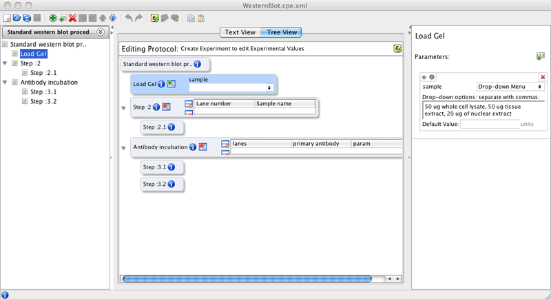
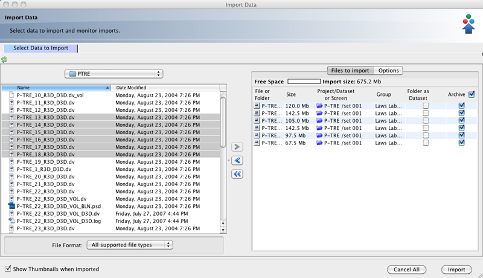

###############
Client Overview
###############

OMERO ships as a server application called *OMERO.server* and a series of clients: *OMERO.insight, OMERO.importer, OMERO.web and OMERO.editor*. All run on the major operating systems and provide image visualisation,
management, and annotation to users from remote locations.
*OMERO.clients* is our collective term for our applications that allows
users access to their data in the *OMERO.server*.

For more detailed information on the OMERO clients, please see the
:doc:`clients/clients` page.

Most laboratories use a number of different imaging platforms and thus
require tools to manage, visualise and analyse heterogeneous sets of
image data recorded in a range of file formats. Ideally a single set of
applications, running on a user's laptop or workstation, could access
all sets of data, and provide easy-to-use access to this data.

We have designed and built several OMERO client applications for use
with the OMERO Server.

OMERO.webclient [1]_
""""""""""""""""""""

OMERO.editor
""""""""""""

OMERO.importer
""""""""""""""

OMERO.insight [2]_
""""""""""""""""""

.. rubric:: Citation

The screenshots make use of data from the JCB DataViewer under the
Creative Commons Attribution-Noncommercial-Share Alike 3.0 Unported
License. For more information see Attribution.

.. [1] Dantas, et al., JCB, DOI: 10.1083/jcb.201012093
.. [2] Snider, et al., JCB, DOI: 10.1083/jcb.201102142