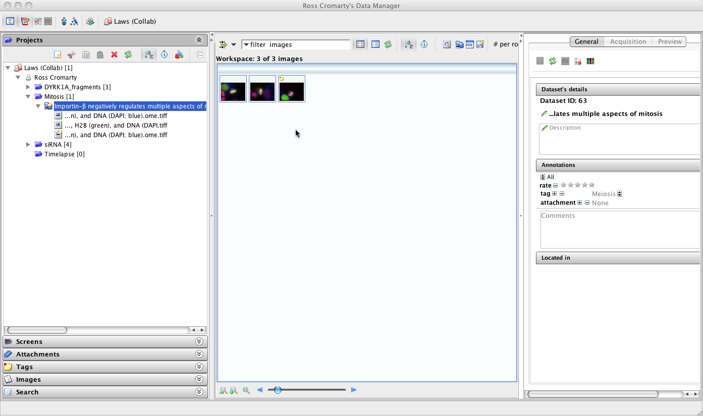

.. _rst_clients_insight:

#######
insight
#######

OMERO.insight provides a number of tools for accessing and using data in
an OMERO Server.
To find out more, see our [OMERO.insight Getting Started Guide]
(../getting-started/tutorial/getting-started).

-  DataManager, a traditional tree-based view of the data hierarchies in
   an OMERO Server. DataManager supports access to all image metadata,
   annotations, tags.
-  ImageViewer, for visualisation of 5D images (space, channel, time).
   The ImageViewer makes use of the OMERO Server's Rendering Engine, and
   provides high-performance viewing of multi-dimensional images on
   standard workstations (e.g. scrolling through space and time),
   without requiring installation of high-powered graphics cards. Most
   importantly, image viewing at remote locations is enable. Image
   rendering settings are saved and chosen by user ID, (e.g. a I can see
   an image with the same rendering settings used by a student).
-  Measurement Tool, a sub-application of ImageViewer that enables size
   and intensity measurements of defined regions-of-interest (ROIs).
   Definition of ROIs is currently completely manual, but will be
   automated in the future.
-  Working Area, for viewing, annotating, and manipulating large sets of
   image data.
-  Administrate users
-  Import image. Feature added in 4.3.0.

OMERO.importer and OMERO.insight are written in Java and require Java
1.5 (or higher) to be installed on the user's computer (automatically
installed on most up-to-date OS X and Windows XP systems).
