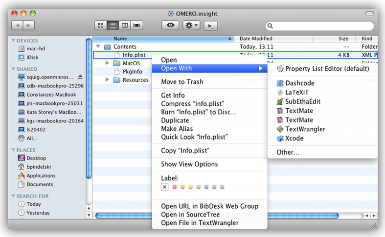

####################################
Adjusting Client Memory Requirements
####################################

By default, the omero clients allocate a certain amount of memory for
themselves during the startup process which should be sufficient for
most uses. However, when dealing with very large images, you may
encounter out of memory exceptions while trying to import or display
these large images. In these situations, it is beneficial to increase
the memory allocation to the clients as outlined below.

NOTE: Increasing the memory of your client applications depends on two
factors: the operating system and the client you're using. Also note
that this guide does not cover OMERO.web, which uses a different
server-based configuration setup.

****************************
Macintosh Importer & Insight
****************************

-  Locate the ``OMERO.importer.app`` or ``OMERO.insight.app`` and right
   click (or control+click) on it, choose ''Show Package Contents''

-  Navigate to the ``Contents`` folder
-  Right-click on the ``Info.plist`` file, this should open the file in
   the either Xcode (if you have that installed), or the Property List
   Editor

-  Within Xcode/Property List Editor, click and open the ``Java`` node
-  Under ``VMOptions``, you will see a line such as ``-Xmx512M``. This
   means you currently have 512 Megabytes reserved for the importer to
   use. Increase this to something like ``-Xmx1024M`` if you wish to
   increase the allocated size to 1024 Megabytes

**************************
Windows Importer & Insight
**************************
-  To alter the memory allocation of the Windows clients, you must add
   an optional parameter file to the same folder as the application. For
   the ``OMERO.importer.exe`` application, this file should be named
   ``OMERO.importer.vmoptions``, for the ``OMERO.insight.exe``
   application, this file should be named ``OMERO.insight.vmoptions``.
-  The easiest way to get this file is to download either the
   :plone:`OMERO.insight <support/omero4/clients/support-files/OMERO.insight.vmoptions>` or
   :plone:`OMERO.importer <support/omero4/clients/support-files/OMERO.importer.vmoptions>`
   file attachment to this document, and copy it into the same directory
   as your exe file (either ``OMERO.importer.exe`` or
   ``OMERO.insight.exe``). The default file increases the memory
   allocation to 1024 Megabytes, however you may if you choose, open the
   file in any text editor (such as notepad.exe) and change the value as
   described in the 'Macintosh Importer & Insight' entry above.

.. image:: ../images/memory_win.png
   :align: center

*****************************
Unix/Linux Importer & Insight
*****************************

-  Changing either the importer or insight memory allocation under Unix
   requires you to edit the startup script located with the clients
   (either ``importer-cli``, ``OMEROimporter_unix.sh``, or
   ``OMEROinsight_unix.sh`` file).
-  For Insight and the Importer GUI, you will need to edit the
   ``OMEROinsight_unix.sh``\ or ``OMEROimporter_unix.sh`` file
   respectively and change the
   ``java -Xms128000000 -Xmx256000000 -jar omero.insight.jar`` line with
   new minimum and preferred memory options (see the Java online
   documentation
   `here <http://docs.oracle.com/javase/6/docs/technotes/tools/solaris/java.html>`_
   for a full description of these options).
-  For the Importer CLI, the required memory requirements are listed
   near the top of the ``importer-cli`` script, and should look like
   this: ``JAVA_ARGS="-Xmx512M"``. Simply update the value to a larger
   number (as described in the Macintosh Importer & Insight' entry
   above).

.. image:: ../images/memory_unix.png
   :align: center