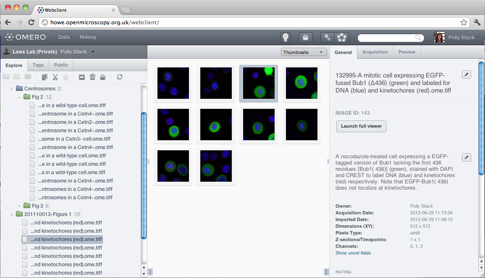

.. _rst_clients_web:

web
===

OMERO in your browser
---------------------

OMERO ships with a web-based client for users who want to access their
data in the browser. This offers a similar view to the OMERO.insight
Java client. Developers can use the :wiki:`OMERO.web <OmeroWeb>`
framework to build their own views on OMERO data.

OMERO.web 4.4
-------------

   
   The OMERO 4.4 web client. Images from ` <http://www.openmicroscopy.org/site/about/licensing-attribution/attribution>`_\ JCB Data Viewer.

In OMERO 4.4, we have made significant changes to the OMERO.web client.
This includes a much nicer looking UI, improvements to the usability of
the User Interface (UI) and other features in the underlying OMERO.web
framework. The web-client also supports Java Webstart of the
OMERO.insight client, allowing users to access its additional
functionality, such as image import and ROI drawing.

Better for users
~~~~~~~~~~~~~~~~

The old webclient UI has received a lot of "polish" to bring consistent
styling across the application. You'll also notice that the UI behaves
better in a number of ways.

-  Hot-key support on the tree navigation: You can traverse the Project,
   Dataset, Image hierarchy using up, down, left, right keys, expanding
   & collapsing containers etc.
-  'Sticky' tabs: The right-hand tabs will stay on the selected tab when
   you select a different Image etc. For example, you can show the
   'Preview' tab for an image, then use the hotkeys to move through all
   images in the Dataset, showing the Preview for each in turn.
-  Keep session alive: The webclient now 'pings' the server so that your
   session is kept alive and you're not logged out when idle for a short
   time.
-  Dialog boxes: No more 'alerts' to confirm delete etc.

Better for developers
~~~~~~~~~~~~~~~~~~~~~

Much of the html and javascript code has been refactored to clean things
up and make it easier to extend the OMERO.web client. We've also
improved various parts of the Python code.

-  OMERO Connection handling: A new decorator for handling connections
   to OMERO, with hooks for customising (see
   ` <http://trac.openmicroscopy.org.uk/ome/wiki/OmeroWeb/WritingViews>`_\ documentation)
-  Public user: Configure a 'public user' who is always logged-in
   automatically, allowing your OMERO.web to support public data (see
   ` <https://www.openmicroscopy.org/site/support/omero4/server/install_web#section-8>`_\ web
   settings)
-  Web 'plugins': Extend the OMERO.web framework to customise the
   display of data from OMERO, then bring this into the existing web
   client.
