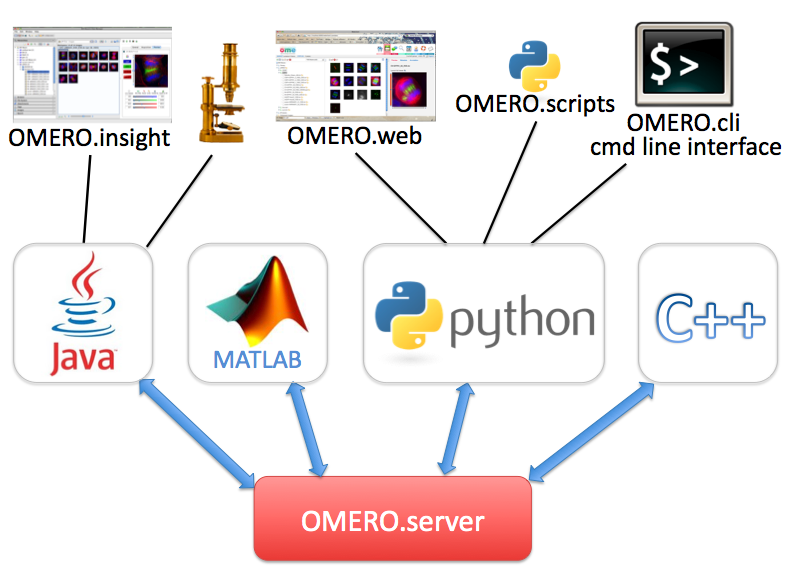
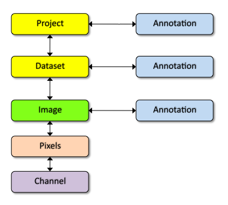

.. _developers/Omero:

OMERO Home Page
===============

Welcome to the OMERO wiki!** This is the home page of the OMERO
developer documentation wiki.

Instructions on :plone:` downloading <support/omero4/downloads>`,
:ref:`rst_installation` and administering OMERO can be found under 
the :ref:`rst_server` of the main site.

What is OMERO?
~~~~~~~~~~~~~~

**OMERO** is an open source client/server system written for
visualizing, managing, and annotating microscope images and metadata.
The |OmeroApi| allows clients to be
written in :ref:`Java <developers/Omero/Java>`, :ref:`Python <developers/Omero/Python>`,
:ref:`C++ <developers/Omero/Cpp>` or :ref:`MATLAB <developers/Omero/Matlab>`. OMERO
releases include a web client |OmeroWeb| and |OmeroCli| which 
use the Python API and a Java client |OmeroInsight|.
There is also an ImageJ plugin. OMERO can be extended by modifying these
clients or by :ref:`writing your own <developers/Omero/GettingStarted/AdvancedClientDevelopment>` in
any of the supported languages (see figure). OMERO also supports a
`Scripting Service </ome/wiki/OmeroScripts>`_ which allows Python
scripts to be run on the server & called from any of the other clients.

**OMERO** is designed, developed and released by the ` Open Microscopy
Environment <http://openmicroscopy.org>`_, with contributions from
` Glencoe Software, Inc. <http://glencoesoftware.com>`_ OMERO is
released under the ` GNU General Public License
(GPL) <http://www.gnu.org/copyleft/gpl.html>`_ with commercial licenses
and customization available from ` Glencoe
Software <http://glencoesoftware.com>`_.

Asking questions
~~~~~~~~~~~~~~~~

For help with any aspect of OMERO, see details of our ` forums and
mailing lists <http://www.openmicroscopy.org.uk/site/community>`_.

OMERO Basics
~~~~~~~~~~~~

OMERO is based on the OME data model which can appear overly complex for
new users. However, the core entities you need for getting started are
much simpler.

Images in OMERO are organised into a many-to-many container hierarchy:
"Project" -> "Dataset" -> "Image". These containers (and various other
objects) can be annotated to link various types of data. Annotation
types include Comment (string), Tag (short string), Boolean, Long, Xml,
File attachment etc.

Images are represented as Pixels with 5 dimensions: X, Y, Z, Channel,
Time.

The OMERO model is implemented as a relational PostgreSQL database on
the OMERO server and mapped to code-generated model objects used by the
clients in the various supported languages (see above). The OMERO API
consists of a number of services for working with these objects and
associated binary data. Typically, clients will use various stateless
services to query the OMERO model and then use the stateful services for
exchange of binary data or image rendering.

A typical client interaction might have an outline such as:

-  Log in to OMERO, obtaining connection and 'service factory'
-  Use the stateless 'Query Service' or 'Container Service' to traverse
   Projects, Datasets and Images
-  Use the stateful 'Rendering Engine' or 'Thumbnail Service' to view
   images.
-  Use the stateful 'Raw Pixels Service' or 'Raw File Store' to retrieve
   pixel or file data for analysis
-  Create new Annotations or other objects and save them with the
   stateless 'Update Service'
-  Close stateful services to free resources and close the connection

Getting started with OMERO development
~~~~~~~~~~~~~~~~~~~~~~~~~~~~~~~~~~~~~~

You may want to start by ` watching "OMERO, the
movie(s)" <https://www.openmicroscopy.org/site/products/feature-list>`_.
On this, you'll find links to a range of movies that demonstrate
features of the OMERO software. After that you will likely want to
:ref:` install the server <rst_installation>` and
` clients <https://www.openmicroscopy.org/site/support/omero4/clients>`_:
Insight, Web. Play with it, test data. You can also try out the |OmeroCli|.

After that, the `WorkingWithOmero </ome/wiki/WorkingWithOmero>`_ page is
probably a good next step. It describes various tools and resources you
will find useful when working with OMERO.

Then, the following wiki pages are meant to provide you with a trail
through the available documentation so that you can get started with
OMERO development. Note that this is not everything that you will need
to read, but should get you started...

The Development Process
^^^^^^^^^^^^^^^^^^^^^^^

-  `Git Usage for OMERO
   developers </ome/wiki/WorkingWithOmero/UsingGit>`_ gives an overview
   of the development process that we currently use which utilises Git &
   Git-Flow (NB. For more information about git see the ` git
   movies <http://users.openmicroscopy.org.uk/~jmoore/git/>`_ that Josh
   prepared.
-  `Developing With OMERO </ome/wiki/OmeroDevelopment>`_
-  `Development Standards </ome/wiki/DevelopmentStandards>`_
-  `Process Overview (Generic) </ome/wiki/DevelopmentGenericProcess>`_
-  `Process Overview (OMERO specific) </ome/wiki/OmeroProcess>`_
-  `Coding Standards </ome/wiki/OmeroCodingStandard>`_

Getting Your Hand's Dirty
^^^^^^^^^^^^^^^^^^^^^^^^^

-  `Working with OMERO </ome/wiki/WorkingWithOmero>`_
-  |ExtendingOmero|
-  |OmeroJava|
-  |OmeroPy|
-  |DevelopingOmeroClients|
-  `Developing Scripts </ome/wiki/OmeroScripts>`_

   -  :ref:`developers/Omero/Modules/Scripts/Guide`
   -  :ref:`developers/Omero/Modules/Scripts/StyleGuide`

-  `Developing WebApps </ome/wiki/OmeroWeb/CreateApp>`_

OMERO Architecture (From a programmer's perspective)
^^^^^^^^^^^^^^^^^^^^^^^^^^^^^^^^^^^^^^^^^^^^^^^^^^^^

-  `OMERO Model </ome/wiki/OmeroModel>`_
-  |OmeroApi|

More pages can be found on the `SiteMap </ome/wiki/SiteMap>`_.

Further Reading
^^^^^^^^^^^^^^^

#. |OmeroApi|
#. |OmeroCli|
#. `OmeroModel </ome/wiki/OmeroModel>`_: Model Documentation
#. |DevelopingOmeroClients|
#. |ExtendingOmero|

Current Development Cycle
-------------------------

We are currently working on the Beta4.4 build, which should be
considered **Beta** software. The last build milestone (Beta4.3.3) was a
maintenance release. The current build milestone (Beta4.4) is focusing
on stability and reliability.

Attachments
~~~~~~~~~~~

-  `api-figure.png </ome/attachment/wiki/OmeroHome/api-figure.png>`_
   `|Download| </ome/raw-attachment/wiki/OmeroHome/api-figure.png>`_
   (179.2 KB) - added by *wmoore* `15
   months </ome/timeline?from=2011-05-06T11%3A32%3A15%2B01%3A00&precision=second>`_
   ago.
-  `model-pdi.png </ome/attachment/wiki/OmeroHome/model-pdi.png>`_
   `|image4| </ome/raw-attachment/wiki/OmeroHome/model-pdi.png>`_ (27.1
   KB) - added by *wmoore* `15
   months </ome/timeline?from=2011-05-21T12%3A26%3A02%2B01%3A00&precision=second>`_
   ago.
