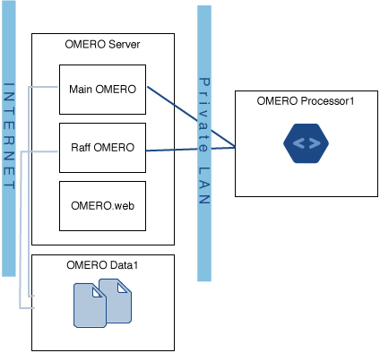

Example production server set-ups
=================================

CellNanOs (Center of Cellular Nanoanalytics), University of Osnabrück
---------------------------------------------------------------------

The OMERO server at 
`CellNanOS <https://www.cellnanos.uni-osnabrueck.de/en/startpage.html>`_
serves a community of 75-100 users and 17 microscope stations (13 different
systems), producing 180-1360 GB of data per day. It is hosted on RedHat 7.3
with data stored on an IBM GPFS file system.

Hardware
^^^^^^^^

- Dell R630 running RedHat 7.3, 32 cores, 128 GB RAM
- IBM GPFS storage, 6 TB SSDs, 178 TB SATA

Network infrastructure
^^^^^^^^^^^^^^^^^^^^^^

1-10 GBit connection between microscope workstations and OMERO

Backup/archive
^^^^^^^^^^^^^^

- IBM TSM 1.4 PB
- daily migration of new data to tape, archive on tape

Micron, Oxford
--------------

The OMERO server at
`Micron, Oxford <https://micronoxford.com/>`_
houses two OMERO instances, the databases for both these instances, and a
single OMERO.web instance which serves them both. The second OMERO instance
(Raff OMERO) originated from another group's private OMERO server, which is
now managed by Micron, but there was no way to merge this data into the main
server. The main OMERO instance is configured to interface to a departmental
LDAP server to authenticate users and get initial authorization details.

OMERO Data1 in the diagram is a large filestore server which hosts all the
image data. This is made available to the OMERO server itself via a Samba
mount. This server has 36 TiB of space of which OMERO is using 16 TiB and Raff
OMERO is using 600 GiB. This is backed up to a tape robot.

OMERO Processor1 consists of a 32 core, 128GiB RAM processing machine for
doing image analysis. This is connected on a completely private network to the
OMERO server (to avoid issues with configuring OMERO.grid to be secure) and
runs scripts using OMERO.grid.

Stats
^^^^^

-  90 users
-  40 groups
-  36 TiB of data storage space, of which 16.6 TiB is currently in use
-  Performance statistics to come

IMCF, Biozentrum, University of Basel
-------------------------------------

The OMERO server at the `IMCF / Biozentrum <https://www.biozentrum.unibas.ch/imcf>`_
has around 650 users and uses more than 200 TB of data storage space, with an
average monthly increase of 10 TB (as of mid-2021). It is run on CentOS 7 with
data hosted on a native-mounted GPFS file system.

Hardware
^^^^^^^^

Remote storage consists of:

-  native-mounted GPFS volume

Local storage consists of:

-  2 x 240 GB SATA SSD, RAID 1, OS and OMERO software
-  2 x 400 GB SATA SSD, RAID 1, Postgres DB

Computational resources:

-  Lenovo System x3650 M5
-  12 Cores (2 x Intel Xeon E5-2643v3 3.4GHz)
-  256 GB RAM

Network infrastructure
^^^^^^^^^^^^^^^^^^^^^^

-  40 Gbit/s Infiniband connection to GPFS storage
-  10 Gbit/s Ethernet connection to the client network

GReD Research Center, Clermont-Ferrand, France
----------------------------------------------

The `Genetics, Reproduction and Development Research Center <https://www.gred-clermont.fr>`_
has 65 users and currently uses 3 TB of storage, with an average monthly
increase of 90 GB. It is run on Debian Squeeze.

Hardware
^^^^^^^^

-  11 TB of storage spread over 8 local hard drives (2 TB), RAID 5

Computational resources:

-  1 Intel Xeon E5506 (4 physical cores)
-  8 GB of memory

Network infrastructure
^^^^^^^^^^^^^^^^^^^^^^

The server is hosted inside the faculty of medicine where the network works at
100 Mbit/s. There are are 4 Gbit/s ports on the server but only one is
currently in use.

.. seealso::

    `IDR deployment page <https://idr.openmicroscopy.org/about/deployment>`_
        Information about the deployment of the
        `Image Data Resource <https://idr.openmicroscopy.org>`_ which hosts
        over 10 million images - see
        https://idr.openmicroscopy.org/about/studies.
