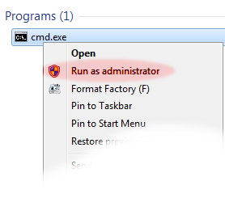

.. _server/install-windows:

OMERO.server Installation for Microsoft Windows
===============================================

-  If you are **upgrading** your OMERO.server installation you should
   follow instructions on the :ref:`rst_upgrade` page.
-  If you are attempting a **UNIX Based Platform install (Linux, Mac OS
   X, etc.)** please see the :ref:`UNIX Based Platform <server/installation>`
   install page.

Limitations
-----------

-  Installation **will require an "administrator" level account** for
   which you know the password. If you are unsure of what it means to
   have a "administrator" level account, or if you are generally having
   issues with the various users/passwords described in this install
   guide, please see :ref:`troubleshooting_password`. Unless you are clear
   on the differences, **you should also open all consoles as an
   administrator to prevent file permission issues.** (See screenshot)

-  Installation on Windows XP is not explicitly supported, especially
   for OMERO.web. Significant testing has taken place on Windows Server
   2008 and we recommend this version.
-  :wiki:`OmeroMovie` does not work on Windows at present.
-  Spaces are not currently supported in installation path names.
   
   .. note:: 
      The default user paths on Windows usually contain spaces so you
      will need to ensure the path has no spaces, ``C:\omero_dist`` for
      example.
-  A reboot is required after installing the prerequisites.

Prerequisites
-------------

    **The following are necessary:**

-  **PostgreSQL 8.4 or higher (9.1 recommended) installed and configured
   with PL/pgSQL and to accept TCP connections.**

   PostgreSQL 8.3 and earlier releases are not supported. See 
   :ref:`rst_limitations`. We suggest using 9.1, and it is
   assumed throughout these instructions. See :ref:`rst_postgresql` 
   for specifics about each version. The
   Windows *One click installer* can be found on the `PostgreSQL Windows
   download page <http://www.postgresql.org/download/windows>`_. You
   will need the postgres user's password later in the install.

   -  You must install PostgreSQL as a service if you want to follow
      this document; other PostgreSQL installation environments are
      supported but are outside the scope of this document.

-  **Java 1.5 SE Development Kit (JDK) or higher installed**
   `<http://www.oracle.com/technetwork/java/javase/downloads/index.html>`_

   Be sure to download the JDK SE version (nor "JRE" nor "EE" versions).

-  **Ice 3.4.x installed**

   Windows installers can be found on the `ZeroC download
   page <http://www.zeroc.com/download.html>`_ and will be called
   something like ``Ice-3.4.2.msi`` (for Ice 3.4.2). If you plan to
   develop for C++, be sure to read the instructions on the
   :wiki:`OmeroCpp` trac page.

-  **Python 2.6.x installed**

   Ice 3.4.x requires Python 2.6.x. You must download the 32-bit version
   from `python.org <http://www.python.org/download/releases/2.6.6/>`_.
   As this is the "vanilla" python distribution (no extra libraries),
   you will need to install further dependencies, making sure to
   download the **correct bitness and Python version**:

   -  *Python for Windows extensions*

      The installer is available from
      `this page <http://sourceforge.net/projects/pywin32/files/pywin32/>`_.

   -  *Python Imaging Library* (only for OMERO.web and Figure creation
      functionality in Insight)

      Packages should be available for **32-bit Python 2.6** from
      `the PIL page <http://www.pythonware.com/products/pil/>`_.

   -  *Matplot Lib* (for OMERO.web only)

      Packages should be available for **32-bit Python 2.6**
      distribution from `the Matplotlib website <http://sourceforge.net/projects/matplotlib/files/matplotlib/>`_.

   -  *Numpy Lib version 1.2.0 or later* (for scripting services)

      NumPy is available at `the main NumPy website <http://sourceforge.net/projects/numpy/files/NumPy/>`_. **It
      is highly recommended you use numpy 1.4.0 or later**.

   -  *PyTables Lib version 2.1 or later* (for :wiki:`OmeroTables`)

      PyTables is available from
      `the PyTables Downloads page <http://www.pytables.org/moin/Downloads>`_.

   -  *scipy.ndimage* allows larger volumes to be viewed in the :plone:`Volume
      Viewer <products/omero/volume-viewer-in-omero.web>`.

      See `scipy <http://numpy.scipy.org/>`_.

    **Finally, you need the OMERO server:**

-  **OMERO.server *ZIP*** available from the :plone:`OMERO downloads <support/omero4/downloads>` page.

Environment variables
---------------------

For the prerequisite software to run properly, both your PATH and
PYTHONPATH **system** environment variables must be configured.

-  **Update your Windows environment variables: (REQUIRES RESTART!)**

   #. Locate the *System* control panel page on the Start Menu under
      :menuselection:`Settings --> Control Panel`, open it and navigate to the *Advanced*
      tab (on Windows Vista the dialog will be visible after clicking
      the *Change settings* link on the *System* control panel page):

      .. figure:: installation-images/system-properties.png
         :align: center
         :alt: Advanced System Properties

         Advanced System Properties
   #. Open the *Environment Variables* dialog by clicking on the
      *Environment Variables...* button of the above dialog:

      .. figure:: installation-images/environment-variables.png
         :align: center
         :alt: Environment Variables

         Environment Variables
   #. Edit the existing *System* environment variable ``Path`` and add a
      new variable pointing to the Ice installation 'bin' directory. At
      the front of the ``Path`` variable also add a new string pointing
      to the Python installation directory (e.g. ``C:\Python26``). Then
      add a brand new *System* environment variable called
      ``PYTHONPATH`` pointing to the Ice installation 'python' location:

      .. |PATH variable| image:: installation-images/path-variable.png
         :alt: Path variable

      .. |PATH variable 2| image:: installation-images/path-variable2.png
         :alt: Path variable

      .. |PYTHONPATH variable| image:: installation-images/pythonpath-variable.png
         :alt: PythonPath variable

      |PATH variable| |PATH variable 2| |PYTHONPATH variable|

   #. **Restart your computer**. For environment changes to take
      effect in background services, a restart is unfortunately
      necessary. See `<http://support.microsoft.com/kb/821761>`_
      for more information.

When performing some operations the clients make use of temporary file
storage and log directories. By default these files are stored below the
users HOME directory in ``$HOME\omero\tmp``, ``$HOME\omero\log`` and
``$HOME\omero\sessions``. If your home(\ ``~``) directory ``$HOME`` is
stored on a network, possibly NFS mounted (or similar), then these
temporary files are being written and read over the network. This can
slow access down.

The OMERO.server also access the ``$HOME\omero/tmp`` and
``$HOME\omero/log`` folders of **the user the server process is running
as**. As the server makes heavier use of these folders than the clients,
if the users home(\ ``~``) is stored on a network the server can be
slowed down. To get round this for the OMERO.server you can define an
``OMERO_TEMPDIR`` environment variable pointing to a temporary directory
located on the local file system (e.g. ``C:\tmp\``).

Installing PostgreSQL
---------------------

#. Run the downloaded installer:

   .. figure:: install-windows-screenshots/pginstall-01explorer.png
      :align: center
      :alt: 1

#. You may be prompted for permission to continue with a "user account
   control" dialog. Click "yes" to continue.

   .. figure:: install-windows-screenshots/pginstall-02uac.png
      :align: center
      :alt: 1

#. The installer will now start.

   .. figure:: install-windows-screenshots/pginstall-03start.png
      :align: center
      :alt: 1

#. Choose the installation directory. The default is fine.

   .. figure:: install-windows-screenshots/pginstall-04bindir.png
      :align: center
      :alt: 1

#. Choose the data directory. The default is fine, but if you want to
   keep the data in a specific location, you may choose an alternative
   location here.

   .. figure:: install-windows-screenshots/pginstall-05datadir.png
      :align: center
      :alt: 1

#. Enter a password for the special "postgres" system account. OMERO
   does not use this account, but you will need to remember the password
   for creating the database, below.

   .. figure:: install-windows-screenshots/pginstall-06passwd.png
      :align: center
      :alt: 1

#. Enter the port number for PostgreSQL to listen on for incoming
   connections. The default, 5432, is fine and should not be changed.

   .. figure:: install-windows-screenshots/pginstall-07port.png
      :align: center
      :alt: PostgreSQL port

#. Select the locale. The default here is fine.

   .. figure:: install-windows-screenshots/pginstall-08locale.png
      :align: center
      :alt: PostgreSQL locale

#. PostgreSQL will now be installed and started.

   .. |pginstall-begincopy| image:: install-windows-screenshots/pginstall-09begincopy.png
      :alt: PostgreSQL Begin copy

   .. |pginstall-complete| image:: install-windows-screenshots/pginstall-10complete.png
      :alt: PostgreSQL Complete

   |pginstall-begincopy| |pginstall-complete|

Creating a database
-------------------

-  Create a non-superuser database user (make sure to note down the name
   and password) using **pgAdmin III**. You can find *pgAdmin III* on
   the Start Menu under :menuselection:`Programs --> PostgreSQL 9.1 --> pgAdmin III`:

   #. Double-click on the *PostgreSQL 9.1* database (or right-click and
      choose *Connect*) and provide your *postgres* user login password
      set during the installation, above.

      .. |pgadmin-start| image:: install-windows-screenshots/pgadmin-01start.png
         :alt: Run pgAdmin III

      .. |pgadmin-initialview| image:: install-windows-screenshots/pgadmin-02initialview.png
         :alt: Connect to the database server

      .. |pgadmin-connect| image:: 	install-windows-screenshots/pgadmin-03connect.png
         :alt: Enter password

      |pgadmin-start| |pgadmin-initialview| |pgadmin-connect|

   #. Right-click on *Login Roles* and select *New Login Role...*

      .. figure:: install-windows-screenshots/pgadmin-04newrole-context.png
         :align: center
         :alt: New login role

         New login role
   #. Create a new role with the *Role name* ``db_user`` and a
      *Password* ``db_password``. Note that these are examples, and you
      should use your own choice of username and password here. You will
      need to configure OMERO to use your username and password by
      setting the omero.db.name and omero.db.pass properties (below).

   .. |newrolename| image:: install-windows-screenshots/pgadmin-05newrole-name.png
	  :alt: New role name

   .. |newrolepassword| image:: install-windows-screenshots/pgadmin-06newrole-passwd.png
	  :alt: New role password

   +---------------+-------------------+
   | |newrolename| | |newrolepassword| |
   +---------------+-------------------+

-  Create an ``omero_database`` database:

   #. Right-click on *Databases* and select *New Database...*

      .. figure:: install-windows-screenshots/pgadmin-07newdatabase-context.png
         :align: center
         :alt: New database

         New database
   #. Create a new database with the *Name* ``omero_database`` and
      *Owner* ``db_user`` (this may take a few moments)

      .. figure:: install-windows-screenshots/pgadmin-08newdatabase-name.png
         :align: center
         :alt: New database name

         New database name

-  Confirm PL/pgSQL language support in your newly created database

   #. First, go to :menuselection:`File --> Options` select the *Browser* tab and
      activate the *Languages* option:

      .. |pgadmin-optionsmenu| image:: install-windows-screenshots/pgadmin-09optionsmenu.png
         :alt: Options menu

      .. |pgadmin-viewlanguages| image:: install-windows-screenshots/pgadmin-10viewlanguages.png
         :alt: Enable display of installed languages

      |pgadmin-optionsmenu| |pgadmin-viewlanguages|

   #. Navigate back to your database, expand the database's tree view
      and finally expand the now available *Languages* item:

      .. figure:: install-windows-screenshots/pgadmin-11installedlanguages.png
         :align: center
         :alt: View installed languages

         View installed languages
   #. If the ``plpgsql`` language is missing, right-click on the
      *Extensions* item and select the *New extension...* option in the
      menu. Finally, add the ``plpgsql`` extension, accepting all
      defaults. This will add both the extension and the language. In
      older PostgreSQL versions without extensions, right-click on the
      *Languages* item and select the *New language...* option in the
      menu. Finally, add the ``plpgsql`` language, accepting all
      defaults.

      .. |pgadmin-newlanguage-context| image:: install-windows-screenshots/pgadmin-12newlanguage-context.png
         :alt: Add new language

      .. |pgadmin-newlanguage-name| image:: install-windows-screenshots/pgadmin-13newlanguage-name.png
         :alt: New language name

      |pgadmin-newlanguage-context| |pgadmin-newlanguage-name|

Location for the your OMERO binary repository
---------------------------------------------

-  Create a directory for the OMERO binary data repository. ``C:\OMERO``
   is the default location and should be used unless you explicitly have
   a reason not to and know what you are doing.

   -  This is *not* where you want the OMERO application to be
      installed, it is a *separate* directory that OMERO.server will use
      to store binary data:
   -  You can read more about the OMERO binary repository
      :ref:`here <rst_binary-repository>`.

--------------

Installation
------------

-  Extract the OMERO ZIP and note its location. Below it is referred to
   as: ``C:\omero_dist``.

   .. note:: Directory names containing spaces are **not** supported!

-  Optionally, review ``C:\omero_dist\etc\omero.properties`` which
   contains all default settings. You will need to open the file with
   WordPad.exe. Don't edit the file. Any configuration settings you
   would like to change can be changed in the next step.

-  Change any settings that are necessary using ``bin\omero config``,
   including the name and/or password for the 'db\_user' database user
   you chose above or the database name if it is not "omero\_database".
   (Quotes are only necessary if the value could be misinterpreted by
   the shell. See link)

   ::

       cd c:\omero_dist
       bin\omero config set omero.db.name omero_database
       bin\omero config set omero.db.user db_user
       bin\omero config set omero.db.pass db_password

-  If you have chosen a non-standard :ref:`rst_binary-repository`
   location above, be sure
   to configure the ``omero.data.dir`` property. When using ``C:\``
   style file paths it is necessary to "escape" the backslashes. For
   example:

   ::

       bin\omero config set omero.data.dir D:\\OMERO

-  Create the OMERO database initialization script. You will be asked
   for the version of the script which you would like to generate, where
   both defaults can be accepted. Finally, you'll be asked to enter and
   confirm password for your newly created OMERO root user (this should
   **not** be the same as your Windows login user!)

   ::

           c:\> cd C:\omero_dist\
           c:\omero_dist> bin\omero db script
           Please enter omero.db.version [OMERO4.4]: 
           Please enter omero.db.patch [0]: 
           Please enter password for new OMERO root user: 
           Please re-enter password for new OMERO root user: 
           Saving to C:\omero_dist\OMERO4.4__0.sql

-  Initialize your database with the script.

   #. Launch *SQL Shell (psql)* from the Start Menu under :menuselection:`Programs -->
      PostgreSQL 9.1 --> SQL Shell (psql)`

      ::

          Server [localhost]:
          Database [postgres]: omero_database
          Port [5432]:
          Username [postgres]: db_user
          Password for user db_user:
          Welcome to psql 9.1.4, the PostgreSQL interactive terminal.

          Type:  \copyright for distribution terms
                 \h for help with SQL commands
                 \? for help with psql commands
                 \g or terminate with semicolon to execute query
                 \q to quit

          Warning: Console code page (437) differs from Windows code page (1252)
                   8-bit characters might not work correctly. See psql reference
                   page "Notes for Windows users" for details.

   #. Execute run the following to populate your database:

      ::

          omero=> \i C:/omero_dist/OMERO4.4__0.sql
          ...
          ...
          omero=> \q

-  Start the server:

   ::

       C:\omero_dist> bin\omero admin start
       Creating var\master
       Initializing var\log
       Creating var\registry
       No descriptor given. Using etc\grid\default.xml
       C:\omero_dist>
       [SC] CreateService SUCCESS

       SERVICE_NAME: OMERO.master
               TYPE               : 10  WIN32_OWN_PROCESS
               STATE              : 2  START_PENDING
                                       (NOT_STOPPABLE,NOT_PAUSABLE,IGNORES_SHUTDOWN)
               WIN32_EXIT_CODE    : 0  (0x0)
               SERVICE_EXIT_CODE  : 0  (0x0)
               CHECKPOINT         : 0x0
               WAIT_HINT          : 0x7d0
               PID                : 2312
               FLAGS              :

       Waiting on startup. Use CTRL-C to exit

-  If you've chosen a non-default install directory (other than
   ``c:\omero_dist``), the output will look like this:

   ::

       C:\OMERO.server-4.4>bin\omero admin start
       Found default value: c:\omero_dist\var\master
       Attempting to correct...
       Converting from c:\omero_dist to C:\OMERO.server-4.4
       Changes made: 6
       No descriptor given. Using etc\grid\windefault.xml
       [SC] CreateService SUCCESS
       ...

-  If you would like to move the directory again, see
   ``bin\winconfig.bat --help``, which gets called automatically on an
   initial install.

--------------

OMERO.web and Administration
----------------------------

OMERO.web is the web application component of the OMERO platform and can
be started with the lightweight development Web server bound to port
4080 on 127.0.0.1 after you've deployed your OMERO.server instance, as
described above. This lightweight web server is written purely in Python
and is ideal for developing and testing OMERO.web. However, this server
is only designed to run in a local environment, and will not deal with
the pressures of a production server used by many people concurrently.

.. note:: In order to deploy OMERO.web in a production environment
   such as Apache or IIS please follow the instructions in the
   :ref:`rst_install_web` section.

Otherwise please give a try of the internal webserver and setup:

::

    c:\omero_dist> bin\omero config set omero.web.application_server development
    c:\omero_dist> bin\omero config set omero.web.session_engine "django.contrib.sessions.backends.cache"
    c:\omero_dist> bin\omero config set omero.web.cache_backend "file://C:/windows/temp/"

then start/stop by

::

    c:\omero_dist> bin\omero web start\stop
    Starting django development webserver... 
    Validating models...
    0 errors found

    Django version 1.1.1, using settings 'omeroweb.settings'
    Development server is running at http://0.0.0.0:4080/
    Quit the server with CONTROL-C.

Once you have deployed and started the server you can use your browser
to access the OMERO.web interface:

-  `http://localhost:4080/ <http://localhost:4080/>`_

   .. figure:: installation-images/login.png
      :align: center
      :alt: OMERO.webadmin login

      OMERO.webadmin login

Enabling Movie creation from OMERO.
-----------------------------------

OMERO has the facility to create AVI/MPEG Movies from Images which can
be called from Insight. The page
`OmeroMovie <http://www.openmicroscopy.org/site/support/omero4/server/omeromovie>`_
gives details on how to enable them.

--------------

Post-installation items
-----------------------

Backup
~~~~~~

One of your first steps after putting your OMERO server into production
should be deciding on when and how you are going to :ref:`backup your
database and binary data <rst_backup-and-restore>`. Please do not omit this
step.

Security
~~~~~~~~

It is now recommended that you read the :ref:`rst_security` page to
get a good idea as to what you need to do to get OMERO clients speaking
to your newly installed OMERO.server in accordance with your institution
or company's security policy.

Advanced configuration
~~~~~~~~~~~~~~~~~~~~~~

Once you have the base server running, you may want to try enabling some
of the advanced features such as :ref:`FS <rst_fs>` or :ref:`LDAP <rst_ldap>`.
If you have ***Flex data***, you may want to watch :snapshot:`the HCS configuration screencast <movies/omero-4-1/mov/FlexPreview4.1-configuration.mov>`.
See the :plone:`Feature list <products/feature-list>` for more advanced
features you may want to use, and :ref:`rst_advanced-configuration` on how to get the most out of
your server.

.. note::
	We are currently looking for a clean and easy way to
	install and enable OMERO.tables under Windows using released packages.
	You may have some success following the :wiki:`OmeroTables`
	wiki page, but currently we do not recommend you use this additional
	feature on Windows. As always, please contact us on our forums if you
	have any additional questions.

Update Notification
~~~~~~~~~~~~~~~~~~~

Your OMERO.server installation will check for updates each time it is
started from the *Open Microscopy Environment* update server. If you
wish to disable this functionality you should do so now as outlined on
the :wiki:`UpgradeCheck` page.

Troubleshooting
~~~~~~~~~~~~~~~

My OMERO install doesn't work! What do I do now!?! Examine the
:ref:`rst_troubleshooting` page and if all else fails post a
message to our ``ome-users`` mailing list discussed on the
:oo:`community <site/community>` page.

OMERO Diagnostics
~~~~~~~~~~~~~~~~~

If you want help with your server installation, please include the
output of the diagnostics command: ``C:omero\_dist> bin\\omero admin
diagnostics``

::

        ================================================================================
        OMERO Diagnostics 4.4.1
        ================================================================================
                
        Commands:   java -version                  1.6.0     (C:\Windows\system32\java.EXE -- 2 others)
        Commands:   python -V                      2.5.5     (C:\Python25\python.EXE)
        Commands:   icegridnode --version          3.3.1     (c:\Ice-3.3.1\bin\icegridnode.EXE)
        Commands:   icegridadmin --version         3.3.1     (c:\Ice-3.3.1\bin\icegridadmin.EXE)
        Commands:   psql --version                 not found
        
        Server:     icegridnode                    running
        Server:     Blitz-0                        active (pid = 3004, enabled)
        Server:     DropBox                        inactive (disabled)
        Server:     FileServer                     active (pid = 2916, enabled)
        Server:     Indexer-0                      active (pid = 1684, enabled)
        Server:     MonitorServer                  active (pid = 3584, enabled)
        Server:     OMERO.Glacier2                 active (pid = 2676, enabled)
        Server:     OMERO.IceStorm                 active (pid = 2220, enabled)
        Server:     PixelData-0                    active (pid = 3784, enabled)
        Server:     Processor-0                    active (pid = 3688, enabled)
        Server:     Tables-0                       active (pid = 344, enabled)
        Server:     TestDropBox                    inactive (enabled)
        
        Log dir:    c:\OMERO-CURRENT\var\log       exists
        
        Log files:  Blitz-0.log                    38.0 MB       errors=26   warnings=104
        Log files:  DropBox.log                    3.0 KB        errors=4    warnings=2
        Log files:  FileServer.log                 0.0 KB
        Log files:  Indexer-0.log                  12.0 KB       errors=48   warnings=3
        Log files:  MonitorServer.log              0.0 KB
        Log files:  OMEROweb.log                   235.0 KB
        Log files:  OMEROweb_request.log           0.0 KB
        Log files:  PixelData-0.log                74.0 KB       errors=11   warnings=65
        Log files:  Processor-0.log                4.0 KB        errors=1    warnings=7
        Log files:  Tables-0.log                   4.0 KB        errors=1    warnings=7
        Log files:  TestDropBox.log                n/a
        Log files:  master.err                     0.0 KB
        Log files:  master.out                     0.0 KB
        Log files:  Total size                     38.72 MB
        
        Parsing Blitz-0.log:[line:30] => Server restarted <=
        
        Environment:OMERO_HOME=(unset)
        Environment:OMERO_NODE=(unset)
        Environment:OMERO_MASTER=(unset)
        Environment:PATH=C:\Python25\;C:\Windows\system32;C:\Windows;C:\Windows\System32\Wbem;C:\Windows\System32\WindowsPowerShell\v1.0
        ome\AppData\Roaming\Python\Scripts
        Environment:ICE_HOME=c:\Ice-3.3.1
        Environment:LD_LIBRARY_PATH=(unset)
        Environment:DYLD_LIBRARY_PATH=(unset)
        
        OMERO data dir: '/OMERO'        Exists? True    Is writable? True
        OMERO.web status... [NOT STARTED]
