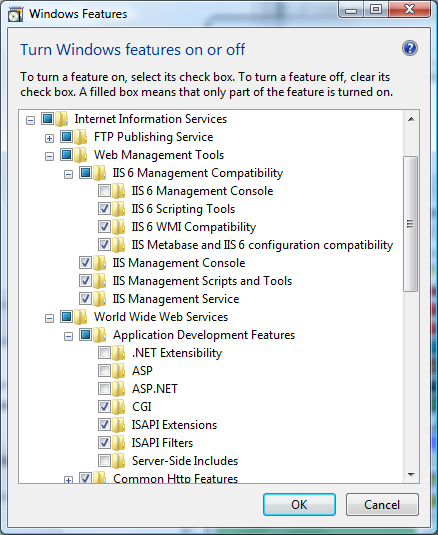
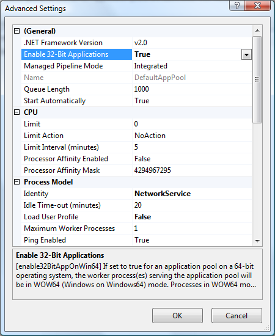

.. _rst_install_web:

OMERO.web deployment
====================

OMERO.web is the web application component of the OMERO platform which
allows for the management, visualisation (in a fully multi-dimensional
image viewer) and annotation of images from a web browser. It also
includes OMERO.webadmin for managing users and groups.

--------------

OMERO.web is an integral part of the OMERO platform and can be deployed
with:

-  IIS 5.1, 6.0 or 7.0 on Microsoft Windows (since OMERO 4.2.1)
-  FastCGI using a FastCGI capable web server such as
   `Apache <http://httpd.apache.org/>`_ (with
   `mod\_fastcgi <http://www.fastcgi.com/>`_ enabled),
   `nginx <http://nginx.org/>`_ or
   `lighttpd <http://www.lighttpd.net/>`_ (since OMERO 4.2.1)
-  The built-in Django lightweight development server (for **testing**
   only)

You can find more information about FastCGI and where to get modules or
packages for your distribution
`here <http://www.fastcgi.com/drupal/node/3>`__.

** If you need help configuring your firewall rules, see the :ref:`rst_security` page. **

Prerequisites
-------------

-  :ref:`OMERO 4.4.0 and its prerequisites <rst_installation>`

-  Python version from 2.4 to 2.7 (due to backwards incompatibilities in
   Python 3.0, Django does not currently work with Python 3.0; for more
   information see the `Django Installation
   page <https://docs.djangoproject.com/en/1.1/intro/install/>`_).

   -  Python Imaging Library Packages should be available for your
      distribution from
      `here <http://www.pythonware.com/products/pil/>`__

   -  Matplot Lib Packages should be available for your distribution
      from `here <http://matplotlib.sourceforge.net/>`__

-  A FastCGI capable web server

Configuring OMERO from the command line
---------------------------------------

Configuration options can be set using the ``bin/omero`` command:

::

    $ bin/omero config set <parameter> <value>

When supplying a value with spaces or multiple elements, use **single
quotes** (Unix, Linux) or **double quotes** (Windows). The quotes will
not be saved as part of the value (see below). Please use the **escape
sequence** ``\"`` for nesting double quotes on Windows (e.g.
``"[\"foo\", \"bar\"]"``).

To remove a configuration option (to return to default values where
mentioned), simply omit the value:

::

    $ bin/omero config set <parameter>

These options will be stored in a file: ``etc/grid/config.xml`` which
you can read for reference. **DO NOT** edit this file directly.

You can also review all your settings by using:

::

    $ bin/omero config get

which should return values without quotation marks.

A final useful option of ``bin/omero`` is:

::

    $ bin/omero config edit

which will allow for editing the configuration in a system-default text
editor.

Quick Start
-----------

Using FastCGI (Unix/Linux)
~~~~~~~~~~~~~~~~~~~~~~~~~~

Once you have installed a FastCGI capable web server, configuration of
OMERO.web is quite straightforward.

-  Choose between FastCGI TCP (recommended) or FastCGI (advanced):

   ::

       $ bin/omero config set omero.web.application_server "fastcgi" / "fastcgi-tcp"

-  Place a stanza in your web server configuration file. The location of
   such file is depending on your system. On OS X it can be saved as
   ``omero.conf`` under ``/private/etc/apache2/other``. Please refer to
   the web server's manual. Apache and nginx configurations can be
   automatically generated for you by OMERO.web as follows:

   ::

       $ bin/omero web config "apache" / "nginx"
       $ bin/omero web config apache
       ...
       ###
       ### Stanza for OMERO.web created 2012-07-12 16:44:16.112099
       ###
       FastCGIExternalServer "/usr/local/dev/openmicroscopy/dist/var/omero.fcgi" -host 0.0.0.0:4080

       <Directory "/usr/local/dev/openmicroscopy/dist/var">
           Options -Indexes FollowSymLinks
           Order allow,deny
           Allow from all
       </Directory>

       <Directory "/usr/local/dev/openmicroscopy/dist/lib/python/omeroweb/static">
           Options -Indexes FollowSymLinks
           Order allow,deny
           Allow from all
       </Directory>

       Alias /static /usr/local/dev/openmicroscopy/dist/lib/python/omeroweb/static
       Alias /omero "/usr/local/dev/openmicroscopy/dist/var/omero.fcgi/"

-  Start the Django FastCGI workers:

   ::

       $ bin/omero web start
       ....
       Copying '/Users/omero/Desktop/omero/lib/python/omeroweb/webstart/static/webstart/img/icon-omero-web.png'

       735 static files copied to '/Users/omero/Desktop/omero/lib/python/omeroweb/static'.
       Starting OMERO.web... [OK]

       **NOTE:** The Django FastCGI workers are managed **separately**
       from other OMERO.server processes. You can check their status or
       stop them using the following commands:

   ::

       $ bin/omero web status
       OMERO.web status... [RUNNING] (PID 59217)
       $ bin/omero web stop
       Stopping OMERO.web... [OK]
       Django FastCGI workers (PID 59217) killed.

Using IIS (Windows)
~~~~~~~~~~~~~~~~~~~

Once you have IIS installed on your system, a straightforward set of
steps is required to get the `ISAPI
WSGI <http://code.google.com/p/isapi-wsgi/>`_ handler for OMERO.web
working with your IIS deployment.

-  Ensure that the ISAPI for IIS options are installed
-  Download and install `an ISAPI
   WSGI Installer <http://code.google.com/p/isapi-wsgi/downloads/list>`_ (we
   suggest the *Windows Installer*)
-  For extended compatibility with multiple IIS versions ISAPI WSGI uses
   the IIS 5/6 WMI interface to interact with your IIS deployment. If
   you are using IIS 7 you must enable the IIS 6 WMI backwards
   compatibility options, as shown on the figure:

   IIS 7 configuration options

-  OMERO.web and ISAPI WSGI are **32-bit** applications on Windows at
   present. If you are attempting to run OMERO.web on a 64-bit version
   of Windows, you must enable 32-bit compatibility in the *Advanced
   Settings...* for the *Application Pool* assigned to your default
   *Site*. You can do this in the *IIS Manager* as follows:

   IIS 7 Application Pool Advanced Settings

-  Configure OMERO.web bindings for IIS

   ::

       C:\omero_dist>bin\omero config set omero.web.session_engine "django.contrib.sessions.backends.cache"

       C:\omero_dist>bin\omero config set omero.web.cache_backend "file://C:/windows/temp/"

       C:\omero_dist>bin\omero web iis

Using the lightweight development server (UNIX or Windows)
~~~~~~~~~~~~~~~~~~~~~~~~~~~~~~~~~~~~~~~~~~~~~~~~~~~~~~~~~~

All that is required to use the Django lightweight development server
(on UNIX or Windows) is to set the *omero.web.application\_server*
configuration option, turn Debugging on and start the server up:

::

    $ bin/omero config set omero.web.application_server development
    $ bin/omero config set omero.web.debug True
    $ bin/omero web start
    Copying '/Users/omero/Desktop/omero/lib/python/omeroweb/feedback/static/feedback/css/layout.css'
    .....
    Copying '/Users/omero/Desktop/omero/lib/python/omeroweb/webstart/static/webstart/img/icon-omero-web.png'

    735 static files copied to '/Users/omero/Desktop/omero/lib/python/omeroweb/static'.
    Starting OMERO.web... Validating models...

    0 errors found
    Django version 1.3.1, using settings 'omeroweb.settings'
    Development server is running at http://0.0.0.0:4080/
    Quit the server with CONTROL-C.

Logging in to OMERO.web
-----------------------

Once you have deployed and started the server, you can use your browser
to access OMERO.webadmin or the OMERO.webclient:

-  **http://your\_host/omero** OR, for development server:
   **http://localhost:4080**

	.. figure:: installation-images/login.png
	   :align: center
	   :alt: OMERO.webadmin login

	   OMERO.webadmin login

    **NOTE:** This starts the server in the foreground. It is your
    responsibility to place it in the background, if required, and
    manage its shutdown.

Customising your OMERO.web installation
---------------------------------------

    **NOTE:** Please use double quotes instead of single quotes and a
    proper escape sequence on Windows to specify options with multiple
    values.

    **NOTE:** For clarity, some edge-case/in-development options may not
    be documented below. For the full list see: $ bin/omero web -h OR
    look in lib/python/omeroweb/settings.py

-  A list of servers the Web client can connect to. Default:
   ``[["localhost", 4064, "omero"]]``.

   -  Unix

      ::

          $ bin/omero config set omero.web.server_list '[["prod.example.com", 4064, "prod"], ["dev.example.com", 4064, "dev"]]'

   -  Windows

      ::

          C:\\OMERO.server\bin>omero config set omero.web.server_list "[[\"prod.example.com\", 4064, \"prod\"], [\"dev.example.com\", 4064, \"dev\"]]"

-  Email server and notification:

   -  (**REQUIRED**) From : address to be used when sending e-mail.
      Default: ``root@localhost``

      ::

          $ bin/omero config set omero.web.server_email "webmaster@example.com"

   -  (**REQUIRED**) Mail server hostname. Default: ``localhost``.

      ::

          $ bin/omero config set omero.web.email_host "email.example.com"

   -  Mail server login username. Default: '' (Empty string).

      ::

          $ bin/omero config set omero.web.email_host_user "username"

   -  Mail server login password. Default: '' (Empty string).

      ::

          $ bin/omero config set omero.web.email_host_password "password"

   -  Mail server port. Default: ``25``.

      ::

          $ bin/omero config set omero.web.email_host_port "2255"

   -  Use TLS when sending e-mail. Default: ``False``.

      ::

          $ bin/omero config set omero.web.email_use_tls "True"

   -  Subject prefix for outgoing e-mail. Default: ``"[Django] "``.

      ::

          $ bin/omero config set omero.web.email_subject_prefix "Subject prefix for outgoing e-mail"

-  Controlling displayed scripts:

   -  Since OMERO 4.3.2, OMERO.web has the ability to dynamically
      display scripts in the script runner menu just like OMERO.insight.
      Some scripts were not suitable for display initially and are
      excluded from the menu. You may wish to control which scripts your
      users can see in OMERO.web using this configuration option.
      Default:
      ``'["/omero/figure_scripts/Movie_Figure.py", "/omero/figure_scripts/Split_View_Figure.py", "/omero/figure_scripts/Thumbnail_Figure.py", "/omero/figure_scripts/ROI_Split_Figure.py", "/omero/export_scripts/Make_Movie.py"]'``

      ::

          $ bin/omero config set omero.web.scripts_to_ignore '[]'
          $ bin/omero config set omero.web.scripts_to_ignore '["/omero/my_scripts/really_buggy.py", ... ]'

-  Enabling a public user:

   -  Since OMERO 4.4.0, OMERO.web has the ability to automatically log
      in a public user.

      -  First, create a public user. You can use any username and
         password you wish. If you don't want this user to be able to
         modify any of the data they see, you should put this user in a
         Read-Only group and the public data should be owned by another
         member(s) of this group. Now you can configure the public user:

      -  Enable and disable the OMERO.web public user functionality.
         Default: ``False``.

         ::

             $ bin/omero config set omero.web.public.enabled True

      -  Set a URL filter for which the OMERO.web public user is allowed
         to navigate. Default: ``^/(?!webadmin)`` (`Python reqular
         expression <http://docs.python.org/library/re.html>`_). You
         probably don't want the whole webclient UI to be publicly
         visible (although you could do this). The idea is that you can
         create the public pages yourself (see `OMERO.web developers
         page <http://trac.openmicroscopy.org.uk/ome/wiki/OmeroWeb>`_
         since we don't provide public pages. E.g. to only allow urls
         that start with '/my\_web\_public' you'd use:

         ::

             $ bin/omero config set omero.web.public.url_filter '^/my_web_public'

             $ bin/omero config set omero.web.public.url_filter'^/(my_web_public|webgateway)'   # OR webgateway

      Exotic matching techniques can be used but more explicit regular
      expressions are needed when attempting to filter based on a base
      URL:

      ::

              'webtest' matches '/webtest' but also '/webclient/webtest'
              'dataset' matches '/webtest/dataset' and also '/webclient/dataset'
              '/webtest' matches '/webtest...' but also '/webclient/webtest'
              '^/webtest' matches '/webtest...' but not '/webclient/webtest'

      -  Server to authenticate against. Default: ``1`` (the first
         server in ``omero.web.server_list``)

         ::

             $ bin/omero config set omero.web.public.server_id 2

      -  Username to use during authentication. Default: ``Not set.``
         (required if ``omero.web.public.enabled=True``):

         ::

             $ bin/omero config set omero.web.public.user '__public__'

      -  Password to use during authentication. Default: ``Not set.``
         (required if ``omero.web.public.enabled=True``):

         ::

             $ bin/omero config set omero.web.public.password 'secret'

-  Administrator e-mail notification:

   -  Admins list of people who get code error notifications. When debug
      mode is off and a view raises an exception, Django will e-mail
      these people with the full exception information. Default: ``[]``
      (Empty list).

      ::

          $ bin/omero config set omero.web.admins '[["Dave", "dave@example.com"], ["Bob", "bob@example.com"]]'

-  Ping interval:

   -  Since OMERO 4.4.0, OMERO.web now pings the server to keep your
      session alive when you are logged in and have an active browser
      window. The duration between these pings can be configured.
      Default: ``60000.`` (every 60 seconds)

      ::

          $ bin/omero config set omero.web.ping_interval 12000

-  Debug mode:

   -  A boolean that turns on/off debug mode. Default: ``False``.

      ::

          $ bin/omero config set omero.web.debug "True"

-  Configuring additional web apps:

   -  The OMERO.web framework allows you to add additional Django apps.
      For an example with installation instructions, see
      `webmobile <https://github.com/openmicroscopy/webmobile/>`_

   -  Download or clone from the git repository into the /omeroweb/
      directory, then run

      ::

          $ bin/omero config set omero.web.apps '["<app name>"]'

Troubleshooting
---------------

My OMERO install doesn't work! What do I do now!?! Examine the
`Troubleshooting <troubleshooting>`_ page and if all else fails post a
message to our forums or ``ome-users`` mailing list or discussed on the
`Community <community>`_ page.