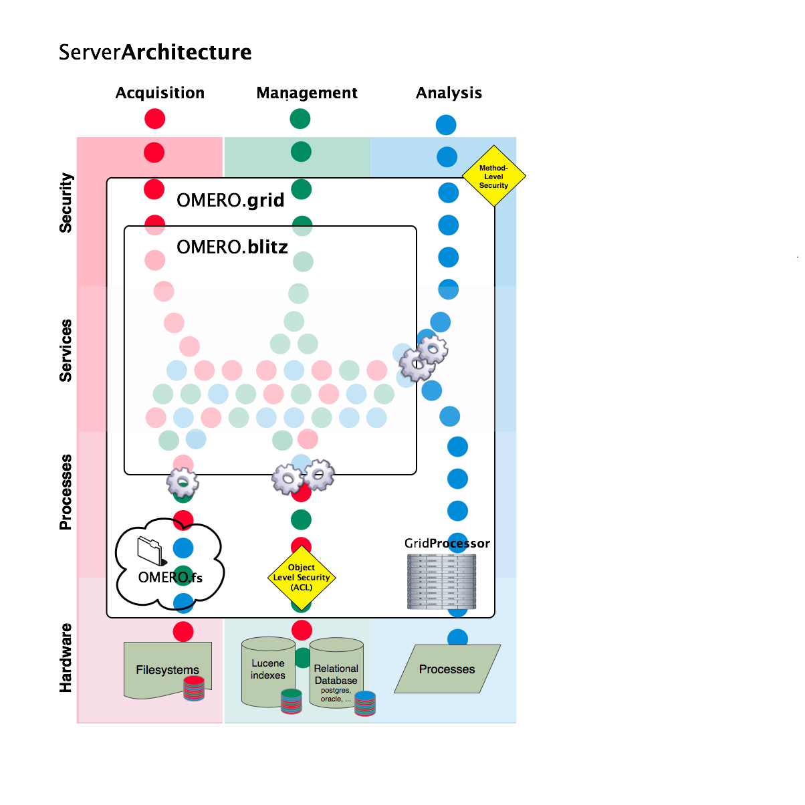

.. _rst_server:

Server Overview
===============

The OMERO server system provides storage and processing of image data
which conforms to the plone:`OME Specification </site/support/file-formats>`.
It can be run on commodity hardware to provide your own storage needs,
or run site-wide to provide a large-scale collaborative environment.

Administration
--------------

Though getting started with the server is relatively straight-forward,
it does require installing several software systems, and more advanced
usage including backups, integrated logins, etc. requires a
knowledgeable system administrator.

After working through the :ref:`rst_gettingstarted`
section, the following guides to administering your installation of
OMERO.server may be of interest:

-  :ref:`OMERO.server Troubleshooting <rst_troubleshooting>`
-  :ref:`OMERO.server Security and Firewalls <rst_security>`
-  :ref:`OMERO.server LDAP <rst_ldap>`
-  :ref:`OMERO.server Backup and Restore <rst_backup-and-restore>`
-  :ref:`OMERO.server Binary Repository <rst_binary-repository>`
-  :ref:`OMERO.server and PostgreSQL <rst_postgresql>`

Developer Documentation
-----------------------

The server system is composed of several components, each of which runs
in a separate process but is co-ordinated centrally.

-  :ref:`OMERO.blitz <rst_blitz>` - The data server provides access to metadata
   stored in a relational database as well as the binary image data on
   disk.
-  :ref:`OMERO.fs <rst_fs>` - A filesystem watcher which notifes the server of
   newly uploaded or modified files.
-  :ref:`OMERO.dropbox <dropbox>` - Utilizes fs to find newly uploaded files and
   run a fully automatic import.
-  :ref:`OMERO.processor <rst_processor>` - Processors provide background
   execution of Python and Matlab scripts.
-  :ref:`OMERO.rendering engine <rst_rendering>` - The RenderingEngine provides
   server-side processing of raw image data for visualization on low-end
   client machines.

If you are interested in building components for the server, modifying
an existing component, or just looking for more background information,
the best starting point is the :wiki:`ServerDesign` page on the server's developer trac.