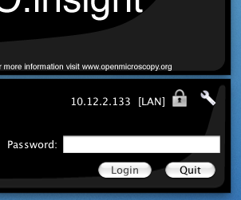

.. _server/security:

OMERO.server Security and Firewalls
===================================

General
-------

OMERO has been built with security in mind. Various standard security
practices have been adhered to during the development of the server and
client including:

-  Encryption of all passwords between client and server via SSL
-  Full encryption of all data when requested via SSL
-  User and group based access control
-  Authentication via LDAP
-  Limited visible TCP ports to ease firewalling
-  Use of a higher level language (Java or Python) to limit buffer
   overflows and other security issues associated with native code
-  Escaping and bind variable use in all SQL interactions performed via
   Hibernate

The OMERO team treats the security of all components with care and
attention. If you have a security issue to report please do not hesitate
to contact us using any one of the mechanisms found on the
:plone:`community <community>` page.

Firewall Configuration
----------------------

Securing your OMERO system with so called *firewalling* or *packet
filtering* can be done quite easily. By default, OMERO clients only need
to connect to two TCP ports for communication with your OMERO.server:
4063 (unsecured) and 4064 (ssl). These are the
`IANA <http://www.iana.org/assignments/port-numbers>`_ assigned port for
the Glacier2 router from ZeroC_. Both of these
values, however, are completely up to you, see SSL below.

Important OMERO ports:

-  **TCP/4063**
-  **TCP/4064**

If you are using :ref:`OMERO.web <server/install_web>`, then you will also need to
make your HTTP and HTTPS ports available. These are usually 80 and 443.

Important OMERO.web ports:

-  **TCP/80**
-  **TCP/443**

Example OpenBSD firewall rules
~~~~~~~~~~~~~~~~~~~~~~~~~~~~~~

::

    block in log on $ext_if from any to <omero_server_ip>
    pass in on $ext_if proto tcp from any to <omero_server_ip> port 4063
    pass in on $ext_if proto tcp from any to <omero_server_ip> port 4064
    pass in on $ext_if proto tcp from any to <omero_server_ip> port 443
    pass in on $ext_if proto tcp from any to <omero_server_ip> port 80

Example Linux firewall rules
~~~~~~~~~~~~~~~~~~~~~~~~~~~~

::

    iptables -P INPUT drop
    iptables -A INPUT -p tcp --dport 4063 -j ACCEPT
    iptables -A INPUT -p tcp --dport 4064 -j ACCEPT
    iptables -A INPUT -p tcp --dport 443 -j ACCEPT
    iptables -A INPUT -p tcp --dport 80 -j ACCEPT
    ...

--------------

Passwords
---------

The password hashes stored in the ``password`` table are generated
equivalent to the command:

::

    $ echo -n "ome" | openssl md5 -binary | openssl base64
    vvFwuczAmpyoRC0Nsv8FCw==

If the password for the root user were lost, the only way to reset it
(in the absence of other admin accounts) would be to manually update the
password table.

::

    $ PASS=`echo -n "ome" | openssl md5 -binary | openssl base64`

    $ psql mydatabase -c " select * from password"
     experimenter_id |           hash           
    -----------------+--------------------------
                   0 | Xr4ilOzQ4PCOq3aQ0qbuaQ==
    (1 row)

    $ psql mydatabase -c "update password set hash = '$PASS' where experimenter_id = 0"
    UPDATE 1

    $ psql mydatabase -c " select * from password"
     experimenter_id |           hash           
    -----------------+--------------------------
                   0 | vvFwuczAmpyoRC0Nsv8FCw==
    (1 row)

If you prefer, the ``bin/omero`` command can generate this update string
for you:

::

    Please enter password for new OMERO root user: 
    Please re-enter password for new OMERO root user: 
    UPDATE password SET hash = 'vvFwuczAmpyoRC0Nsv8FCw==' WHERE experimenter_id = 0;
    $ 

Java Key- and Trust stores.
---------------------------

If your server is connecting to another server over SSL, you will need
to configure both a keystore and a truststore for the Java process. This
happens, for example, when your LDAP server uses SSL. See the :ref:`LDAP
plugin <server/ldap>` for information on how to configure the LDAP
urls. As with all configuration properties, you will need to restart
your server after changing them.

To do this, you will need to configure several server properties,
similar to the properties you configured during
:ref:`installation <server/installation>` (:ref:`Windows <server/install-windows>`).

-  key store path

   ::

       bin/omero config set omero.security.keyStore /home/user/.mystore

       A keystore is a database of private keys and their associated
       X.509 certificate chains authenticating the corresponding public
       keys.

-  key store password

   ::

       bin/omero config set omero.security.keyStorePassword secret

-  trust store path

   ::

       bin/omero config set omero.security.trustStore /home/user/.keystore

       A truststore is a database of trusted entities and their
       associated X.509 certificate chains authenticating the
       corresponding public keys. The truststore contains the
       Certificate Authority (CA) certificates and the certificate(s) of
       the other party to which this entity intends to send encrypted
       (confidential) data. This file must contain the public key
       certificates of the CA and the client's public key certificate.

-  trust store password

   ::

       bin/omero config set omero.security.trustStorePassword secret

.. _security_ssl:

SSL
---

Especially if you are going to use LDAP authentication to your server,
it is important to encrypt the transport channel between clients and the
Glacier2 router to keep your passwords safe.

By default, all logins to OMERO occur over SSL using an anonymous
handshake. After the initial connection, clients can request to have
communication un-encrypted to speed up image loading by clicking on the
lock symbol. An unlocked symbol means that non-password related
activities (i.e. anything other than login and changing your password)
will be unencrypted, and the only critical connection which is passed in
the clear is your session id.

Administrators can configure OMERO such that unencrypted connections are
not allowed, and the user's choice will be silently ignored. The SSL and
non-SSL ports are configured in the etc/grid/default.xml and
windefault.xml files, and as described above, default to 4064 and 4063
respectively, and can be modified with command:

::

        $ bin/omero admin ports --help
        usage: bin/omero admin ports [-h] [--prefix PREFIX] [--registry REGISTRY]
                                     [--tcp TCP] [--ssl SSL] [--revert]

        Allows modifying the ports from a standard OMERO install

        To have two OMERO's running on the same machine, several ports must be modified from their default values.
        Internally, this command uses the omero.install.change_ports module.

        Examples:

            bin/omero admin ports --prefix=1                             # sets ports to: 14061, 14063, 14064
            bin/omero admin ports --prefix=1 --revert                    # sets ports back to: 4061, 4063, 4064
            bin/omero admin ports --registry=4444 --tcp=5555 --ssl=6666  # sets ports to: 4444 5555 6666

        Optional Arguments:
          In addition to any higher level options

          -h, --help           show this help message and exit
          --prefix PREFIX      Adds a prefix to each port ON TOP OF any other settings
          --registry REGISTRY  Registry port. (default: 4061)
          --tcp TCP            The tcp port to be used by Glacier2 (default: 4063)
          --ssl SSL            The ssl port to be used by Glacier2 (default: 4064
          --revert             Used to rollback from the given settings to the defaults

--------------

.. seealso:: :ref:`server/ldap`
