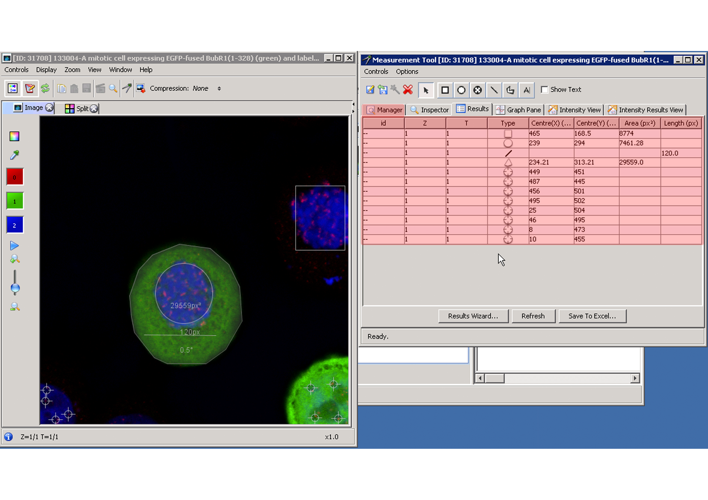
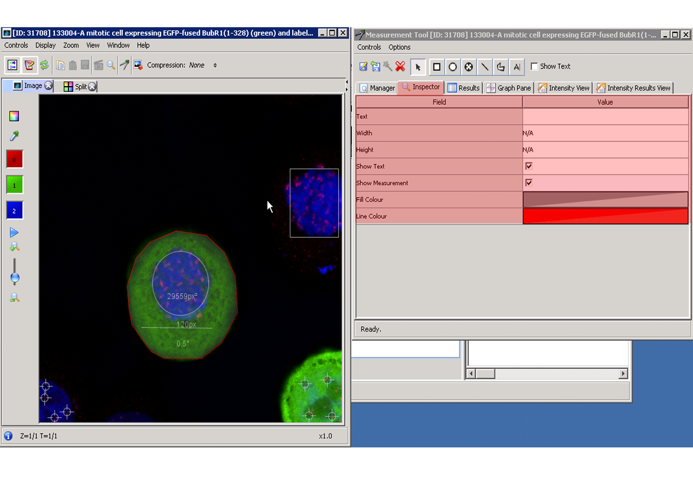
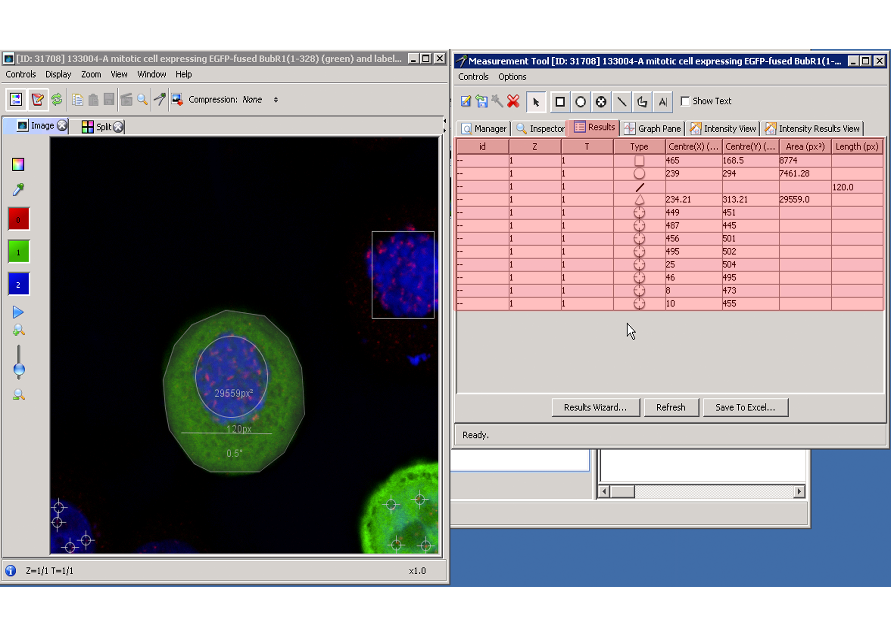
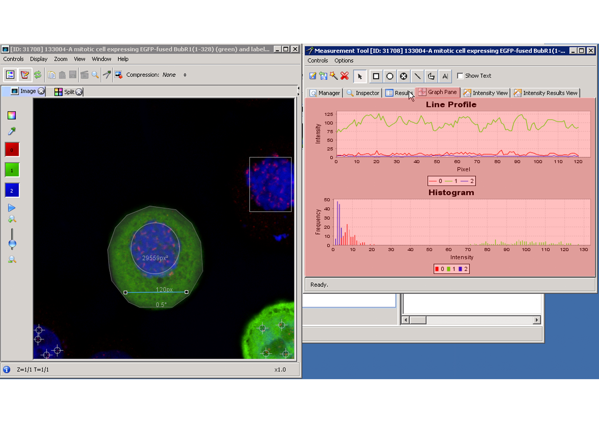
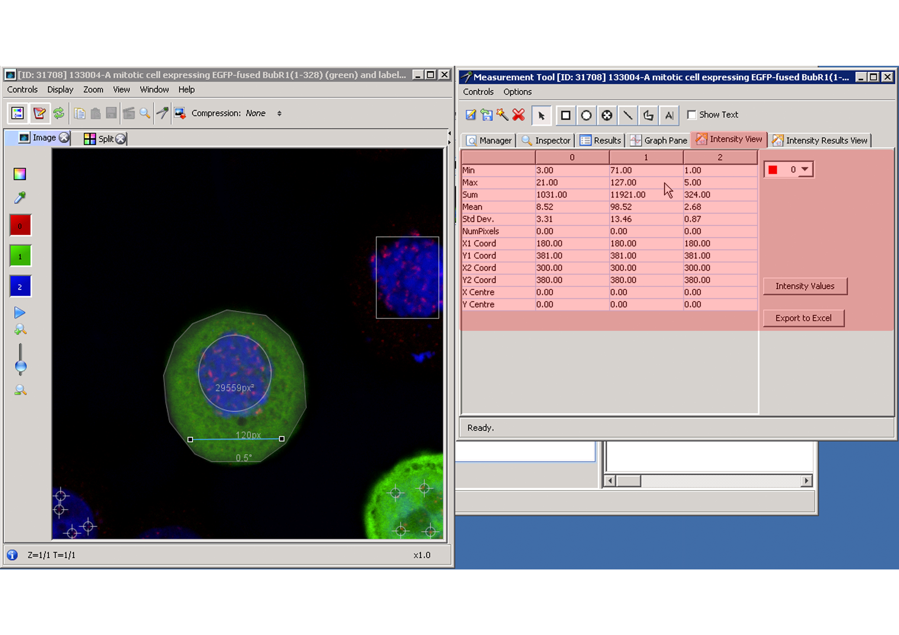
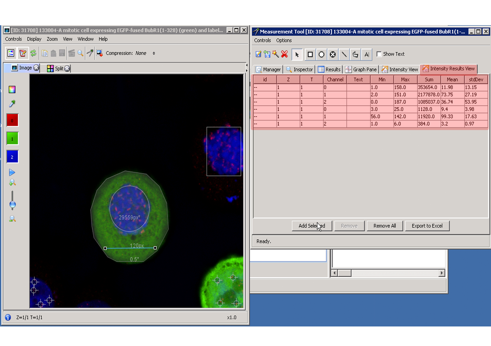

Analysing Your Data in OMERO 
============================

Overview
--------
   This page describes the measurement tool in OMERO.  
   

The Measurement Tool 
--------------------
On select an image in the workspace panel and double clicking on the image to bring up the image viewer.
In the image viewer toolbar click the  icon to bring up the Measurement Tool.

.. image:: graphx/analysingyourdata_measurementtool.png
 

(A screenshot with the measurement tool open and tool bar annotated with the list of ROI's that can be drawn)

To create an ROI you can use the toolbar shown below to select what type of ROI is to be created.

To create an ROI, first click on the ROI type you wish to create, then click on the image viewer and drag the shape to the desired size.
Once a ROI is created it can be manipulated by first clicking on the arrow icon. Depending on the shape it can be moved, resized or rotated. Double clicking on a line will split it into two segments creating a polyline, this can be repeated to create as many segments as needed. The nodes on the line can be moved around to the required shape. Double clicking inside a shape will allow you to enter a text label.

ROI Manager
^^^^^^^^^^^
Once ROIs are created, these appear in the ROI manager tab. The ROI manager tab is the default view of the ROI tool. Using the manager tab it is possible to select the individual ROIs. The visibility check box also allows you to toggle the visibility of the ROI in the image viewer.

..(Comment - I have taken 5 separate screenshots of all five tabs that are available under the ROI manager).

ROI Inspector
^^^^^^^^^^^^^  
The ROI inspector is accessed by clicking on the inspector tab. The inspector panel allows you to edit various properties of the ROI.

ROI Results  
^^^^^^^^^^^
The ROI results are accessed by clicking on the results tab. This panel contains the various geometrical properties for the ROI.

ROI Graph Pane
^^^^^^^^^^^^^^
The ROI graph pane is accessed by clicking on the graph pane tab. The graph pane panel will display the histogram for the selected ROI.

ROI Intensity View
^^^^^^^^^^^^^^^^^^
The ROI intensity view is accessed by clicking on the intensity view tab.This panel displays various statistics about the intensity values contained in an ROI. 

ROI Intensity Results View
^^^^^^^^^^^^^^^^^^^^^^^^^^
The ROI intensity view is accessed by clicking on the intensity view tab.This panel presents an alternative view of the previous intensity view values. The information can again be exported to Excel.

