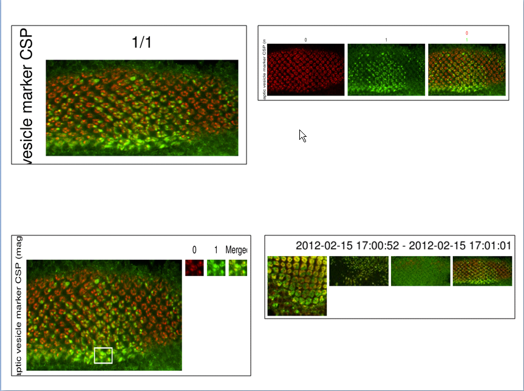

Getting Your Data Out of OMERO 
==============================

.. topic:: Overview

   The ability to export the data from OMERO has already been shown in the sections of the image viewer and data       
   manager with the options of exporting to OME-TIFF, export a tag report, save the displayed thumbnails, and saving  
   an image. This section now focuses specifically on the publishing options of OMERO for producing figures. The 
   feature allows you to export images as figures, based on their annotations, metadata, and regions of interest on   
   the image. All figures are saved as attachments to the appropriate Project, Dataset or Image, and are also present 
   to download. A figure legend is generated for each figure and available is to download as a text file which 
   contains additional details for each image, such as name, ID, scale bar size, rendering settings, projected 
   planes, pixel size, etc. 

..
   [Comment - YOU TEND TO ALTERNATE SOME SUB-HEADINGS WITH CAPITALS FOR ALL FIRST LETTERS AND OTHERS ALL LOWER CASE. 
   MAKE SURE YOU KEEP THIS CONSISTENT].

Publishing Options
^^^^^^^^^^^^^^^^^^
In the metadata browser panel found on the right hand side, locate the icon. Clicking on this icon will reveal a drop-down menu of publishing tools as shown below.

.. image:: graphx/gettingyourdataout_publish.png
    :width: 700px
    :align: center
    :height: 700px

Make Movie
^^^^^^^^^^
Select this to create a movie from your multi-dimensional image data. You can specify the ranges of Z and T frames to use. You can choose whether to display a scale bar and/or any labels.

Split View Figure
^^^^^^^^^^^^^^^^^
Choose one or more images to be arranged in a split-channel view figure with one image per row. When making the figure, for each image you can select which channels should be shown individually and which are included in the merged panel for that row.

..
  COMMENT: BE CAREFUL OF INTERCHANGEABLY USING FIGURE & IMAGE - I'VE ALSO ADDED PANEL HERE TO TRY AND HELP - IT CAN   
  EASILY.BECOME VERY CONFUSING] [I need to ensure that when I say figure I mean a figure created by OMERO of the 
  chosen images. So a figure is not equal to an image in this instance.

ROI Split Figure
^^^^^^^^^^^^^^^^^
If a rectangle ROI has been defined for an image (or images), then you can create a figure that displays the ROI as a larger panel to the right of the main image, zoomed by a chosen factor. The zoomed ROI can be split into selected channels, as for the split-view figure. Images can be labeled with their name, the name of their dataset(s) or associated tags.

Thumbnail Figure
^^^^^^^^^^^^^^^^
This creates a figure of thumbnails, either using the currently selected images or all of the images in a dataset. The date range of the images is displayed on the figure, and it is also possible to choose a list of tags to sort the images by.

Movie Figure
^^^^^^^^^^^^
This produces a figure of a movie, showing panels of different frames it then saves the figure as a jpg or png attached to the first image in the figure.

.. COMMENT:this image figure results will be annotated with the information from above.

