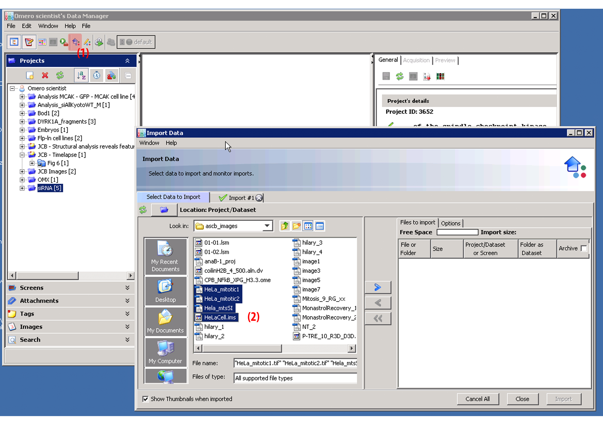
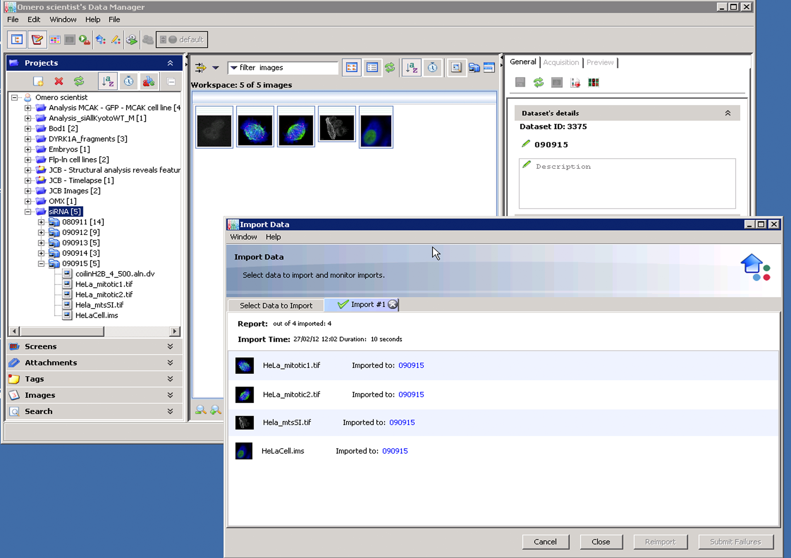

Importing Data into OMERO 
=========================

Overview
--------
This page describes how to import your data to OMERO.

Starting Import From OMERO.insight
^^^^^^^^^^^^^^^^^^^^^^^^^^^^^^^^^^
In order to begin the import of images into OMERO you need to click on the OMERO.insight importer icon, shown by point (1). You are then presented with the import data window illustrated by point (2). 

To import images with the importer, the import process follows the three steps of: The File Selection, Location selection and Import these steps are described below.

The File & Location Selection 
^^^^^^^^^^^^^^^^^^^^^^^^^^^^^
Use the File Chooser to browse and select the images.

Select the file(s) to import by pressing the right arrow icon when clicked on the location Selection window pops up as shown below. OMERO uses a Project/Dataset hierarchy structure and so a new Project/Dataset can be created for each import or if available an existing Project/Dataset can be selected.

.. image:: graphx/importingData_locationselection.png
    :width: 700px
    :align: center
    :height: 700px

Import
^^^^^^
When ready the image files can now be imported by clicking the import button.

On import, the Import tab will open. The following information is presented in the Import tab:

  * The  number of files/folders imported.
  * The  number of cancellations if any.
  * The import start time and the duration of the import.
  * The names of any tags if any.

 
On the completion of the import, the data is located in the Data Manager.

