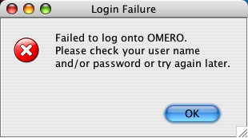

.. _rst_troubleshooting:

***************
Troubleshooting
***************

Frequently Asked Questions
==========================

If you can't find what you are looking for here, you might also peruse
the :plone:`FAQ <support/faq>`.

Known Operating System issues
=============================

-  Gentoo requires a special patch for compiling Ice (link requested)
-  Ubuntu 08.04 has issues with older Ice packages (`ome-users
   thread <http://lists.openmicroscopy.org.uk/pipermail/ome-users/2009-June/001839.html>`__)
-  OpenSuSE 10.1 has issues with Python 2.4/2.5 and Ice (`ome-users
   thread <http://lists.openmicroscopy.org.uk/pipermail/ome-users/2009-June/001830.html>`__)
-  Windows XP does not run 'Development Server' version of OMERO.web
   (`OME forum topic <http://www.openmicroscopy.org/community/viewtopic.php?f=5&t=640>`__)
   and :ref:`rst_limitations`

.. _troubleshooting_password:

Which password do I use where?
==============================

Example accounts table. These are the example usernames and passwords
used in various install pages:

========== ======== ========== =============
Account    Type     Username   Password
========== ======== ========== =============
Install    Machine  omero_user                
Postgres   Database db_user    db_password
OMERO root OMERO    root       root_password
========== ======== ========== =============

There are a total of three types of user accounts which are important
during the installation process.

-  The first type includes **accounts on your machine**. There is one
   regular account (either your own or one you created specially for
   running OMERO, we'll call it "omero\_user" here); there is the user
   called a "root-level user" on the :ref:`Unix installation
   page <server/installation>` (which includes Mac OS X) and
   "administrator-level user" on the :ref:`Windows installation
   page <server/install-windows>`; and there may be a special
   "postgres" user who controls the database server. The regular
   "omero\_user" account runs the server, and owns the files uploaded to
   OMERO. This account must have permission to write to the /OMERO/
   binary repository. Some operations in the install scripts require the
   root-level/administrator-level user in order to become another user
   like "postgres" to perform particular operations (E.g. create
   database). However **the server should never be run as the
   root-level/administrator-level user or as the database-owner.**

-  The second type of account is the **database account**. The
   database-owner ("postgres") can create users completely separate from
   the accounts on your machine. (Though confusingly, the database-user
   may have the same name as an account on your machine, in which case a
   password **might** not be necessary.) A single database account is
   used at run time by OMERO to talk to your database. Therefore you
   have to configure the "omero.db.\*" values during installation.

   ::

       $ bin/omero config set omero.db.user db_user
       $ bin/omero config set omero.db.pass db_password

-  The last type of account are **OMERO accounts**. The first user which
   you will need to configure is the "root" OMERO user (different from
   any root-level Unix account). This is done by setting the password in
   the database script:

   ::

       $ bin/omero db script
       Please enter omero.db.version [OMERO4.4]: 
       Please enter omero.db.patch [0]: 
       Please enter password for new OMERO root user:       # root_password
       Please re-enter password for new OMERO root user:      # root_password
       Saving to ~/OMERO4.4__0.sql

Other OMERO users can be created via the web admin tool. In no case, do
any of the passwords have to be the same (or should they **unless you
are using the LDAP plugin**...)

OutOfMemoryError / PermGen space errors in OMERO.server logs
============================================================

Out of memory or permanent generation (PermGen) errors can be caused by
many things. Fundamentally you may be asking too much of the server and
require and increase of the maximum Java heap or permanent generation
space. This can be done by modifying the IceGrid configuration for your
OMERO.server as follows:

-  In ``etc/grid/templates.xml``:

   ::

       ...

       <server-template id="BlitzTemplate">
         <parameter name="index"/>
         <parameter name="config" default="default"/>
         <server id="Blitz-${index}" exe="java" activation="always" pwd="${OMERO_HOME}">
           <!--
           Debugging options:
           <option>-Xdebug</option>
           <option>-Xrunjdwp:server=y,transport=dt_socket,address=8787,suspend=n</option>
           -->
           <option>-Xmx512M</option>
           <option>-Djava.awt.headless=true</option>
           <option>-Dlog4j.configuration=${OMERO_ETC}log4j.xml</option>
           ...

   Replace ``-Xmx512M`` with ``-Xmx1024M``,
   ``-Xmx1024M -XX:MaxPermSize=128m`` or greater as required.

Furthermore, under certain conditions access of images greater than 4GB
can be problematic on 32-bit platforms due to certain bugs within the
Java Virtual Machine including `Bug ID:
4724038 <http://bugs.sun.com/bugdatabase/view_bug.do?bug_id=4724038>`_.
A 64-bit platform for your OMERO.server is **HIGHLY** recommended.

SocketException: Network is unreachable errors in your OMERO.server log on Debian
=================================================================================

This is a Debian specific
`bug <http://bugs.debian.org/cgi-bin/bugreport.cgi?bug=560044>`_.

Quick fix for users hit by this:

::

        sudo sed -i 's/net.ipv6.bindv6only\ =\ 1/net.ipv6.bindv6only\ =\ 0/' \
        /etc/sysctl.d/bindv6only.conf && sudo invoke-rc.d procps restart

There is an OMERO `forum
post <http://www.openmicroscopy.org/community/viewtopic.php?f=5&t=415>`_
for comments on the issue.

Import error when running ``bin/omero ...``
===========================================

::

        Traceback (most recent call last):
        File "bin/omero", line 67, in ?
            import omero.cli
        ImportError: No module named omero.cli

If you get any import related errors while running ``bin/omero``, the
most likely cause is that your PYTHONPATH is not properly set.

-  If you installed Ice globally via your package manager, make sure you
   included ice-python

-  If you installed Ice manually, e.g. under ``/opt/Ice-3.3.1`` you need
   to add ``/opt/Ice-3.3.1/python`` (or similar) to your PYTHONPATH
   environment variable. See the Ice installation instructions for more
   information.

Remote clients can't connect to my OMERO installation!
======================================================

The OMERO WebAdmin appears to work fine and you may or may not have
created some users but no matter what you do remote clients won't speak
to OMERO. OMERO.insight gives you an error message similar to the
following (and you know that you've put the correct username and
password into the OMERO.insight dialog):

This often because of firewall misconfiguration on the machine that runs
your OMERO server which affects the ability of remote clients to locate
it. Please see the :ref:`OMERO security page <rst_security>`.

Server fails to start
=====================

1. Check that you are able to successfully connect to your PostgreSQL
   installation as outlined on the :ref:`PostgreSQL
   page <rst_postgresql>`.
2. Check the permissions on your ``omero.data.dir`` (``/OMERO`` by
   default) as outlined on the :ref:`OMERO Install <server/installation>`
   page, in the ''Pre-Installation'' section.
3. Are you on a laptop? If you see an error message mentioning 
   :ticket:`"node master couldn't be reached" <7325>`, you
   may be suffering from a network address swap. Ice does not like to
   have its network changed as can happen if the server is running on a
   laptop on wireless. If you lose connectivty to icegridnode, you may
   have to kill it manually via ``kill PID`` or ``killall icegridnode``
   (under Unix).
4. If you see an error message mentioning
   :ticket:`"Freeze::DatabaseException" <5576>` or 
   :ticket:`"could not lock file: var/registry/\_\_Freeze/lock" <7325>`,
   your icegrid registry may have become corrupted. This is not a
   problem, but it will be necessary to stop OMERO and delete the
   ``var/master`` directory (e.g. ``rm -rf var/master``). When
   restarting OMERO, the registry will be automatically re-created.

Connection Problems and TCP Window Scaling
==========================================

Later versions of the 2.6 Linux kernel, specifically 2.6.17, have TCP
window scaling enabled by default. If you're having initial logins never
timeout or problems with connectivity in general you can try turning the
feature off as follows:

::

    # echo 0 > /proc/sys/net/ipv4/tcp_window_scaling

You can read more about the problems surrounding TCP window scaling
`here <http://kerneltrap.org/node/6723>`__.

My Server Crashes With...
=========================

-  ``X11 connection rejected because of wrong authentication``
-  ``X connection to localhost:10.0 broken (explicit kill or server shutdown).``

OMERO uses image scaling and processing techniques that may be
interfered with when used with SSH X11-forwarding. You should disable
SSH X11-forwarding in the SSH session you will use to start OMERO.server
by using the ``-x`` flag as follows:

::

    ssh -x my_server.examples.com

Server or clients print "WARNING: Prefs file removed in background..."
======================================================================

::

    Nov 12, 2008 3:02:50 PM java.util.prefs.FileSystemPreferences$7 run
    WARNING: Prefs file removed in background /root/.java/.userPrefs/prefs.xml
    Nov 12, 2008 3:02:50 PM java.util.prefs.FileSystemPreferences$7 run
    WARNING: Prefs file removed in background /usr/lib/jvm/java-1.7.0-icedtea-1.7.0.0/jre/.systemPrefs/prefs.xml

These warnings (also sometimes listed as ERRORS) can be safely ignored,
and are solely related to how Java is installed on your system. See
http://bugs.sun.com/bugdatabase/view\_bug.do?bug\_id=4751177 or perhaps
this
`thread <http://lists.openmicroscopy.org.uk/pipermail/ome-users/2009-March/001465.html>`_
on our mailing list for more information.

DropBox fails to start: Failed to get session
=============================================

If the main server starts but DropBox fails with the following entry in
``var/log/DropBox.log``,

::

    2011-06-07 03:42:56,775 ERROR [                        fsclient.DropBox] (MainThread) Failed to get Session: 

then it may be that the server is taking a relatively long time to
start.

A solution to this is to increase the number of retries and/or the
period (seconds) between retries in ``etc/grid/templates.xml``

::

    <property name="omero.fs.maxRetries"  value="5"/>
    <property name="omero.fs.retryInterval"  value="3"/>

OMERO.web and "ImportError: No module named rtypes."
====================================================

To avoid that error please change the following in your settings.py:

::

    import os.path
    import sys
    import datetime
    import logging

    import omero
    import omero.clients

OMERO.web is not accessible from remote computer.
=================================================

If you require to configure the out of the box setup to listen for 
webadmin and webclient connections on different host run by:

::

	c:\omero_dist> bin/omero web start 'host' 'port'
	Starting django development webserver... 
	Validating models...
	0 errors found

	Django version 1.1.1, using settings 'omeroweb.settings'
	Development server is running at http://host:port/
	Quit the server with CONTROL-C.

OMERO.web did not start on the production.
==========================================

The user opening OMEROweb.log files needs write permissions to the
directory containing the logs file. So, bee sure you have a "log"
directory with the correct ownership and correct path set in LOGDIR
matches log directory.

-  In your ``/home/omero/omero_dist/var/lib/`` directory add the
   following to your ``custom_settings.py`` file:

   -  LOGDIR

      ::

          LOGDIR = '/home/omero/weblog/'

-  Checking if ``/home/omero/omero_dist/var/lib/custom_settings.py``
   exist.

-  Checking who owns the log directory and log files:

   ::

       $ ls -al /home/omero/weblog/
       total 49
       drwxr-xr-x  2 apache apache   120 Mar 31 11:29 .
       drwxr-xr-x 10 apache apache   520 Mar 31 11:29 ..
       -rw-r--r--  1 apache apache 23766 Mar 31 11:41 OMEROweb.log
       -rw-r--r--  1 apache apache 23978 Mar 31 11:41 OMEROweb.log.2009-03-31

-  or create log and database directories with
   ``apache_user:apache_group`` ownership or another who you want to run
   with:

   ::

       mkdir /home/omero/weblog
       chown apache_user:apache_group /home/omero/weblog

OMERO.web 'Drive space' does not generate pie chart/'My account' does not show markup picture and crop the picture
===================================================================================================================

Error message says: 'Piechart could not be displayed. Please check log
file to solve the problem'. Please check ``var/log/OMEROweb.log`` for
more details. There are few already known possibilities:

-  'TclError: no display name and no $DISPLAY environment variable'.
   Turn off the compilation of TCL support in matplotlib.
-  'ImportError: No module named Image'. Install Python Imaging Library
   - packages should be available for your distribution from
   `here <http://www.pythonware.com/products/pil/>`__. Also double check
   if all of the prerequisites were installed from
   :ref:`here <rst_install_web>`.

Mod\_python error: "PythonHandler django.core.handlers.modpython"
=================================================================

Double check if apache\_user has enough permissions to:
'/home/omero/omero\_dir/lib/python/',
'/home/omero/omero\_dir/lib/python/django',
'/home/omero/omero\_dir/lib/python/omeroweb',
'/home/omero/omero\_dir/var/lib'.

OMERO.scripts fails with "MarshalException" when using PostgreSQL 9.0
=====================================================================

If all script executions fail after a upgrading your database to
PostgreSQL 9.0 with an error like:

:: 

   Caused by: org.openmicroscopy.shoola.env.data.ProcessException: Cannot run script with ID:52
       at org.openmicroscopy.shoola.env.data.OMEROGateway.runScript(OMEROGateway.java:514)
       at org.openmicroscopy.shoola.env.data.OMEROGateway.createMovie(OMEROGateway.java:5750)
       ... 9 more
   Caused by: omero.InternalException
       serverStackTrace = "Ice.MarshalException
                               reason = (null)
                               at IceInternal.BasicStream.typeToClass(BasicStream.java:2403)
                               at IceInternal.BasicStream.findClass(BasicStream.java:2320)
                               at IceInternal.BasicStream.loadObjectFactory(BasicStream.java:2187)

then most likely the bytea\_output setting of your database needs to be
changed. See :ref:`rst_postgresql` for how to do
this and, optionally, :ticket:`5662` for more technical details.

Too many open files
===================

This is caused by the number of opened files exceeding the limit imposed
by your operating system. It might be due to OMERO leaking file
descriptors; if you are not using the latest version, please upgrade,
since a number of bugs which could cause this behaviour have been fixed.
It is also possible for buggy scripts which do not properly release
resources to cause this to occur. To view the current per-process limit,
run

::

            ulimit -Hn

which will show the hard limit for the maximum number of file
descriptors (-Sn will show the soft limit). This limit may be increased.
On Linux, see /etc/security/limits.conf (global PAM per-user limits
configuration); it is also possible to increase the limit in the shell
with

::

            ulimit -n newlimit

providing that you are uid 0 (other users can only increase the soft
limit up to the hard limit). To view the system limit, run

::

            cat /proc/sys/fs/file-max

On MacOS X, the standard ulimit won't work properly. There are several
different ways of setting the ulimit, depending upon the version of OS X
you are using, but the most common are to edit sysctl.conf or
launchd.conf to raise the limit. However, note that both of these
methods change the defaults for every process on the system, not just
for a single user or service.
