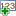

.. _rst_tutorial_editor-getting-started:

Getting Started with OMERO.editor
=================================

This is a very quick guide on how to begin working with the OMERO.editor
tool.

A number of example protocol files are available on-line, for
demonstrating how you might record an experiment with OMERO.editor. To
download and view these files, click on the 'www-folder' icon |www
folder| in the tool-bar. This will present you with a dialog where you
can choose from a selection of example files and open them in the Editor
(not shown).

Start Blank Protocol
--------------------

To start a blank protocol, click the 'new-file' icon ![new file]
(../images/filenew.png) in the tool bar. The following screen will appear:

.. raw:: html

   

.. raw:: html

   

The first 'step' of the protocol has been added. This is the "Title
Step" of the protocol and it's name can be edited in the top of the
right panel.

.. raw:: html

   

.. raw:: html

   

To add additional steps to the protocol, click the |Add Icon| icon in
the tool bar. Steps will be added below the currently selected step.

.. raw:: html

   

.. raw:: html

   

To add text to the step, simply type in the step in the center panel.
The step can also be given a name by editing in the right panel as
before.

In the example below, the text was copied, pasted and edited from a
protocol available as a
`PDF <http://www.lamondlab.com/pdf/fix&stain.pdf>`_ described
`here <http://www.lamondlab.com/f7immunostainprotocol.htm>`_.

.. raw:: html

   

.. raw:: html

   

After adding another step, pasting some more text, and editing the name
of the step, the file looks like this:

.. raw:: html

   

.. raw:: html

   

Now it's time to add parameters to this protocol. The "parameters" are
variables in the protocol that change often and can be used to summarise
the protocol.

Parameters can be defined from existing text by highlighting the text,
and clicking the "Add Parameter" icon |Add Parameter Icon| beside the
text.

.. raw:: html

   

.. raw:: html

   

A parameter has been added in place of the highlighted text, and the
parameter has been named using that text. The parameter name can be seen
and edited in the panel to the right. It is also possible to set a
default value and change the "type" of parameter here.

.. raw:: html

   

.. raw:: html

   

Next, change the name of the parameter to "fixative" and the type of
parameter from "text" to "Drop-down menu" using the chooser in the right
panel. Now enter some options for the parameter (separated by commas)
e.g. "Methanol, Paraformaldehyde". If you wish, you can now choose one
of these options as a default value for this parameter.

.. raw:: html

   

.. raw:: html

   

Click "Save" to save the current file. If you are connected to the
server, you will have a choice of saving the file to the server, or
saving the file locally to your computer.

.. raw:: html

   

.. raw:: html

   

It is also possible to save any file as a new file to the server or
locally using options in the File menu.

.. raw:: html

   

.. raw:: html

   

.. |Add Icon| image:: ../images/nuvola_add16.png

