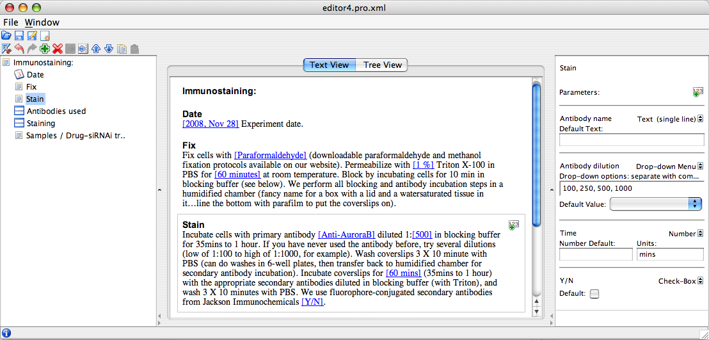

.. _tutorial/editor:

OMERO.editor Introduction
=========================

This tool can operate as a standalone application or as part of the
OMERO.insight client. In both cases, it saves metadata as XML files that
can be used to annotate images, datasets, etc, in OMERO. If used as part
of OMERO.insight, the files can be saved to an OMERO server. For
features that are new to the Beta-4 OMERO.editor (March 2009), 
see :ref:`tutorial/editor-latest-features`.

OMERO.editor is a Java tool and requires `Java 1.5 <http://java.com/en/download/>`_. The latest release of OMERO.editor can
be downloaded as part of the OMERO clients package from our :plone:`downloads page <support/omero4/downloads>`.

A :snapshot:`demo movie <omero/editor/movies/OMERO.editor-Beta4.mov>` of the Beta-4 software gives an introduction to the Editor and illustrates some of its functionalities.

The OMERO.editor has been designed to achieve two key functions:

-  Facilitate the digital recording of experimental metadata.

-  Enable important parameters to be distinguished from the main text,
   e.g. to summarise the experiment in a concise form.

The workspace of the editor displays the complete protocol in the
largest central panel. To the left, an outline of the protocol can be
used for navigation and the panel on the right of the window is used for
display and editing of parameter details. The central panel can be used
to view the protocol in a 'Text View' (below) or in a 'Tree View' as
described under :ref:`tutorial/editor-latest-features`.

