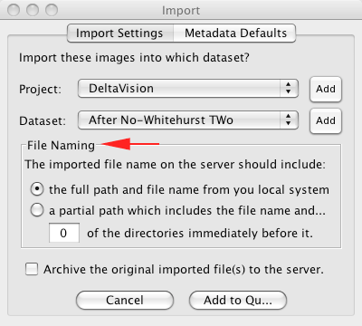

.. _tutorial/import-images:

Importing Images
================

To get the list of file formats currently supported in OMERO, go to
`LOCI bio-formats library <http://loci.wisc.edu/software/bio-formats>`_

In order to import images into an OMERO server, you need to:

-  Launch the OMERO.importer application.
-  Connect to the server (see :ref:`tutorial/insight-getting-started`).

Images Selection
----------------

One of the main issues is knowing which file to click on, during the
import process. Part of the problem here is that the import supports
over one hundred different file formats, some of which share common file
names (most notably 'tiff' images).

In almost all of these cases, the file format includes a metadata 'head'
file with a different file extension, and this should be the file you
select for import. Often the importer will be able to automatically
determine which file format you are importing by selecting any of the
files in the same directory as this head file, but in other cases, you
will have to provide the importer with a 'hint' but selecting the right
file for it before importing.

Some examples of file formats with multiple files include:

============= ====================
*Format*      *Main Extension*
------------- --------------------
Flex          ``.mea`` or ``.res``
InCell 1000   ``.xdce``
Metamorph     ``.nd`` or ``.stk``
Zeiss LSM     ``.lsm`` or ``.mdb``
============= ====================

Single Image Formats vs. Screening Formats
------------------------------------------

The other thing worth considering during import is the 'type' of image
you are importing. Single- or project-based images typically go into
'datasets', where as screen-based image sets typically go into
'screens'. If you have properly selected the main file for the format
(as described above), the importer will usually only let you import the
file into the appropriate 'container' type (either a dataset or screen).

The other important thing to remember is that you cannot import two
files of different types from the same directory, so do not mix your
screening data with your dataset data! Doing so will generate a warning
message in the importer and you will need to split the two file types
apart before continuing.

Import Image
------------

.. figure:: ../images/importer-filequeue.png
   :align: center
   :alt:

-  User the File Chooser panel to browser and select the images.
-  Add the selected images to the Import Queue by pressing the icon.
-  The ``Import`` window pops up (see below).

Where and How
-------------

-  Select or Add a project and dataset where to import the images.
-  The File Naming section allows to select the name of the imported
   images

   -  short version e.g. ``myImage.tiff``
   -  full version e.g. ``C:importantWork/stuff/myImage.tiff``
   -  customised version i.e. the short version plus a number of leading
      directories e.g. ``stuff/myImage.tiff``

-  Press the ``Add to Queue`` button.

Import
------

Once you have finished selecting images, press the ``Import`` button.
You can view the progress in the ``Status`` column of the
``Import Queue``.
