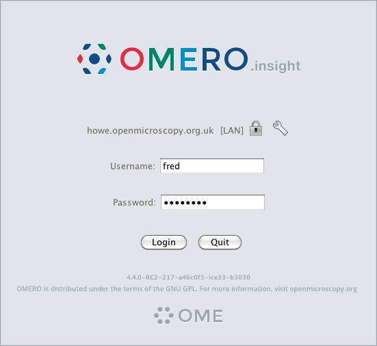
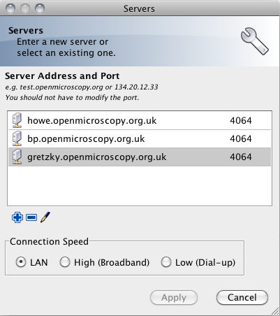
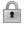
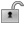

.. _rst_insight-getting-started:

Getting Started with OMERO.insight
==================================

Download
--------

First of, you MUST have an `OMERO
server <http://trac.openmicroscopy.org.uk/ome>`_ installed. You need to
download and install the version of OMERO.insight or OMERO.importer
compatible with your OMERO.server version.

The latest versions are available for download from the 
:plone:`Milestone Download <support/omero4/downloads>` page. Once downloaded,
double-click the package to start the install process.

Logging in
----------

The administrator who set the OMERO server will provide you with a
username, a password and the address of the OMERO server where your data
will be stored. If the administrator opted to use LDAP authentication,
you should be able to use your usual username and password. The
authentication connection to the server is ALWAYS secured.

The log-in procedure is the same for OMERO.importer and OMERO.insight.

Select server
-------------

To enter the address of the server, click on the icon in the top-right
corner of the login window. A ``Servers`` dialog will pop up.

You can either:

1. Add the address of a new OMERO server by clicking on the |add| icon.
2. To edit an existing OMERO, select the server to edit and click on the
   |edit| icon.
3. Same as 2., then click on the port.

   ..note::
       The default port is ``4064``, you should not have to modify this value. If you have to, your system administrator will give you the new value.
                                                                                                                                                        

You can also indicate the speed of your network connection:

-  LAN (default value)
-  High
-  Low

The network speed setting is used to set the compression level used to
render images on the server and transfer to the client application. i.e.

-  LAN: No compression
-  High: Medium compression
-  Low: High compression

Then click the ``Apply`` button.

.. note:: 
    The name of the selected server and the connection's speed are
    displayed in the ``Login Dialog``.

Secure Data Transfer
--------------------

The connection to the server is always secured. Nevertheless, it is
possible to select to encrypt the data transfer if desired. If selected,
the data transfer will be slower but more secure.

-  To encrypt the transfer, click on |encrypted| .
-  By default, the data transfer is not encrypted i.e. |decrypted| .

