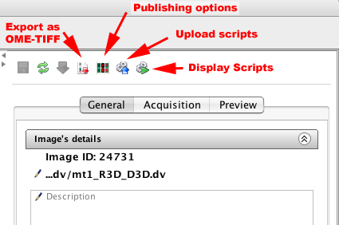
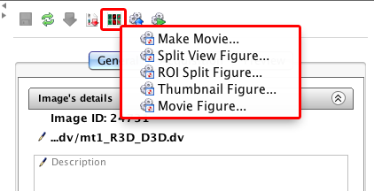
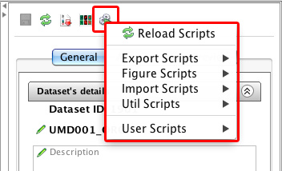

.. _rst_tutorial_insight-scripts:

Running Scripts
===============

Through OMERO's scripting service (see :wiki:`OMERO scripts <OmeroScripts>`), OMERO.insight allows you to create specialized views of your images for publishing and for running simple analysis against your data.

Publishing Options
------------------

The publishing button allows you make movies or create various views of your images for publishing. To find out more about the publishing scripts, go to :ref:`rst_tutorial_insight-export-figures`.

Upload Scripts
--------------

Use the upload scripts dialog to upload scripts to the server. For user guide about scripting, see :wiki:`Scripting Service Guide <OmeroPy/ScriptingServiceGuide>`.

.. figure:: ../images/insight-scripting-3upload.png
   :align: center
   :alt: OMERO.insight script upload

Display Scripts
---------------

All the scripts accessible to you on the server are accessible via the Display Scripts button.

